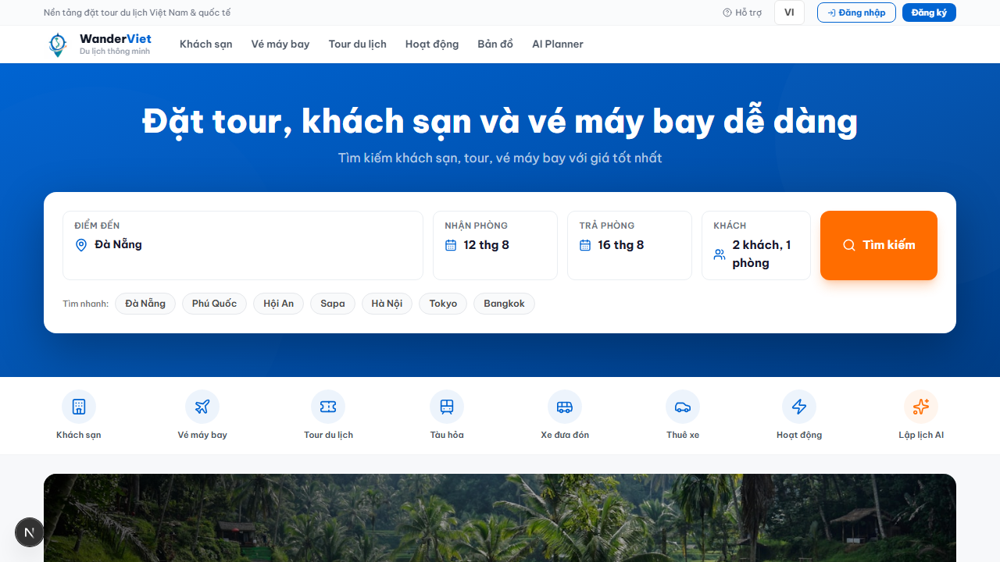
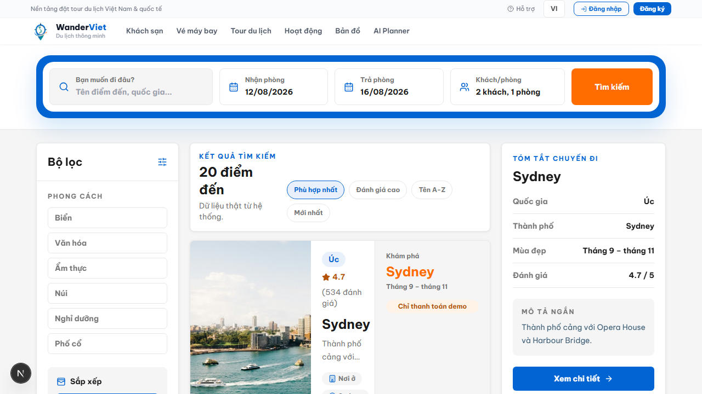
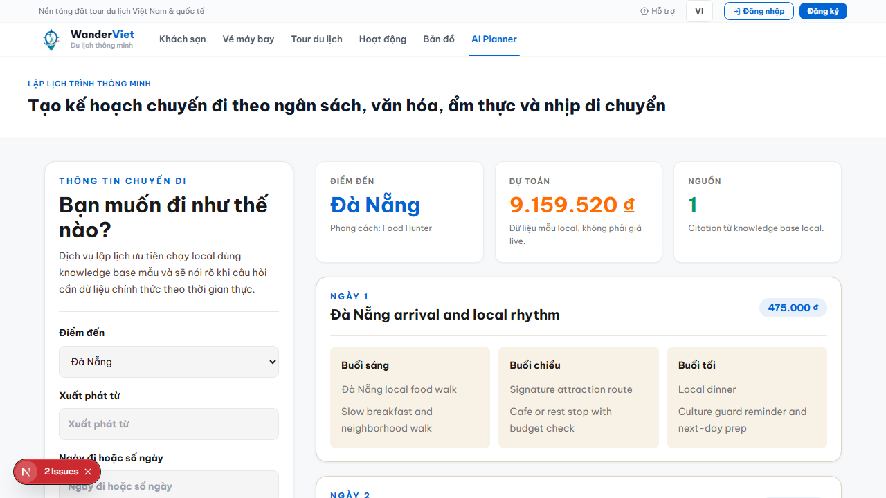
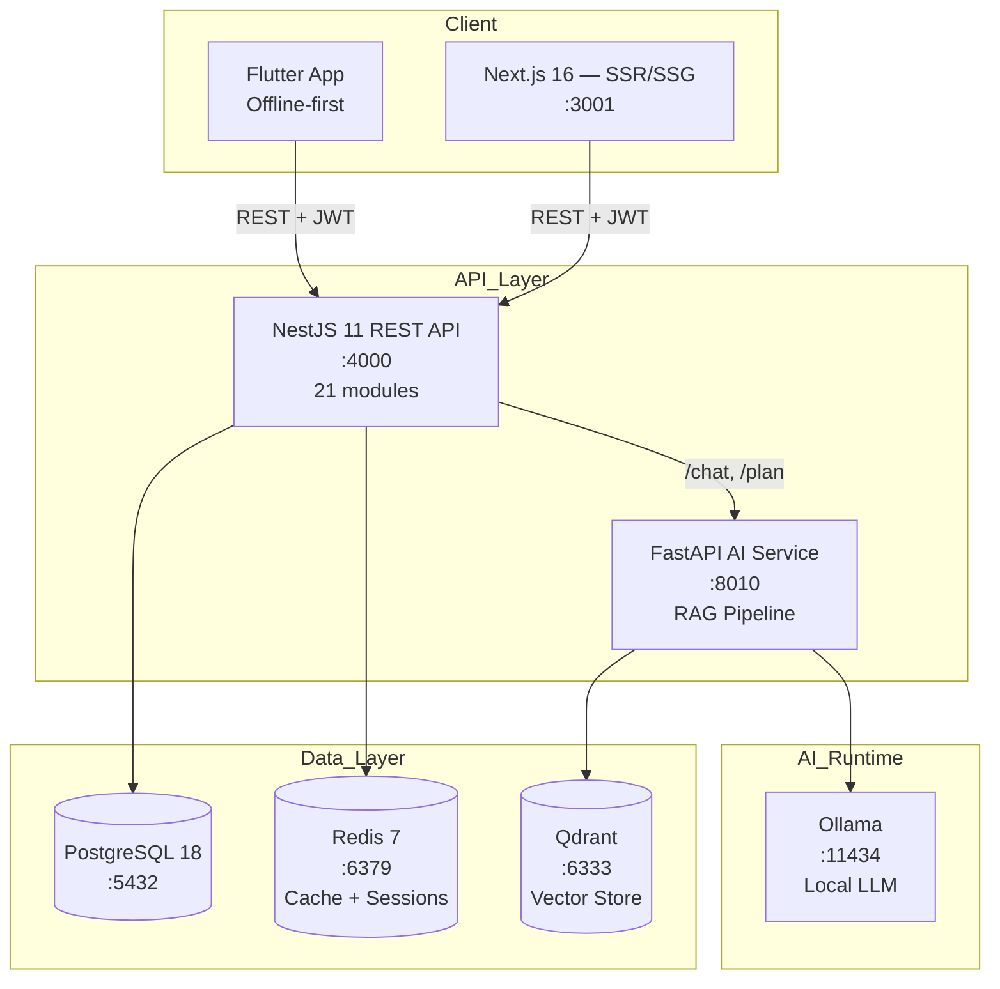

<p align="center">
  <h1 align="center">WanderViet — Vietnam Travel Platform</h1>
  <p align="center">
    <em>Full-stack travel platform | Monorepo | AI-powered | 41 pages | Production-ready</em>
  </p>
</p>

<p align="center">
  <a href="https://github.com/JasonTM17/ChillTravel_NextJS/actions/workflows/ci.yml">
    
  </a>
  <a href="https://hub.docker.com/r/nguyenson1710/wanderviet-api">
    
  </a>
  <a href="https://hub.docker.com/r/nguyenson1710/wanderviet-web">
    
  </a>
  
  
  
  
  
  
  
  <a href="./LICENSE">
    
  </a>
</p>

<p align="center">
  <a href="./README.md">Tiếng Việt</a> |
  <a href="#quick-start">Quick Start</a> |
  <a href="#documentation">Docs</a> |
  <a href="#api-documentation">API Docs</a>
</p>

---

<p align="center">
  
</p>

## Introduction

**WanderViet** is a comprehensive travel platform for the Vietnamese market, enabling users to search and book tours, hotels, and flights. The system integrates an AI chatbot for travel consultation powered by a fully local language model (Ollama + RAG), with no cloud API dependency.

Built with modern monorepo architecture, applying best practices in security, testing, CI/CD, and containerization.

### Demo

|                          Homepage                           |                          Explore                           |                          AI Planner                           |
| :---------------------------------------------------------: | :--------------------------------------------------------: | :-----------------------------------------------------------: |
|  |  |  |

```
41 web pages | 21 API modules | 10 AI endpoints | 12 mobile screens
```

---

## UI Showcase

### Homepage

<p align="center">
  
  &nbsp;
  
</p>

### Login & Authentication

<p align="center">
  
</p>

### Tour Detail — Gallery, Itinerary, Booking

<p align="center">
  
</p>

### Explore Destinations & Map

<p align="center">
  
  &nbsp;
  
</p>

<p align="center">
  
</p>

### Hotel Detail & Booking Flow

<p align="center">
  
  &nbsp;
  
</p>

### Flight Search

<p align="center">
  
</p>

### AI Travel Assistant

<p align="center">
  
  &nbsp;
  
</p>

<p align="center">
  
  &nbsp;
  
</p>

### Admin Dashboard — Analytics & Management

<p align="center">
  
</p>

---

## Tech Stack

| Layer           | Technology                        | Version      |
| --------------- | --------------------------------- | ------------ |
| **Frontend**    | Next.js + React 19 + Tailwind CSS | 16.x         |
| **Backend**     | NestJS + TypeScript               | 11.x         |
| **Database**    | PostgreSQL + Prisma ORM           | 18 / 7.x     |
| **AI Service**  | FastAPI + Ollama + Qdrant         | Python 3.12+ |
| **Mobile**      | Flutter + Dart + Riverpod         | 3.x          |
| **Monorepo**    | pnpm Workspaces + Turborepo       | 10.x / 2.x   |
| **Testing**     | Vitest + Playwright + k6          | Latest       |
| **CI/CD**       | GitHub Actions (7 jobs) + Docker  | —            |
| **Cache**       | Redis                             | 7.x          |
| **Vector DB**   | Qdrant                            | Latest       |
| **LLM Runtime** | Ollama                            | Latest       |

---

## System Architecture

```
wanderviet/
├── apps/
│   ├── api/            # NestJS 11 — REST API (21 modules), Swagger at /api/docs
│   ├── web/            # Next.js 16 — 41 pages, Vietnamese-first UI
│   ├── ai-service/     # FastAPI — Local RAG (Ollama + Qdrant), 10 endpoints
│   └── mobile/         # Flutter — 12 screens, offline-first
├── packages/
│   ├── shared/         # Shared TypeScript types & API contracts
│   ├── db/             # Prisma schema, migrations, seed data
│   └── config/         # Shared ESLint, TypeScript, build configs
├── infra/docker/       # Docker Compose (6 services) + Dockerfiles
├── e2e/                # Playwright E2E tests (4 critical flows)
├── load-tests/         # k6 load test scripts
└── docs/               # ADRs, ER diagram, architecture, features
```



---

## Technical Highlights

| Aspect                   | Details                                                                               |
| ------------------------ | ------------------------------------------------------------------------------------- |
| **Local AI/RAG**         | Ollama LLM + Qdrant vector DB — no API keys, no cost, data stays private              |
| **True monorepo**        | pnpm workspaces + Turborepo — shared types, parallel builds, dependency graph         |
| **Security**             | JWT rotation (15m access / 7d refresh), rate limiting, CORS, helmet, input validation |
| **Production Docker**    | Multi-stage builds, non-root user, health checks, layer caching                       |
| **CI/CD (7 jobs)**       | typecheck, lint+test, security audit, gitleaks, E2E, Docker build, mobile             |
| **Multi-layer testing**  | Unit (Vitest) + E2E (Playwright) + Load (k6) + Property-based (fast-check)            |
| **Mobile offline-first** | Flutter + Riverpod, local cache, sandbox bookings, offline AI fallback                |
| **Design System**        | Custom Tailwind tokens (tv-\*), responsive, WCAG accessible                           |
| **4 ADRs**               | Documented decisions: NestJS, Prisma, mock payment, monorepo structure                |

---

## Feature Details

### Booking System

- Tour booking with detailed itinerary, photo gallery, reviews
- Hotel booking with price filters, amenities, location
- Flight search with price comparison
- Demo payment system (sandbox, no real transactions)
- Discount codes and loyalty program

### AI Features

- **AI Trip Planner** — Auto-generate itinerary by days, budget, preferences
- **Chat Assistant** — Q&A about travel, destination suggestions, cuisine
- **Budget Estimator** — Cost estimation by destination and duration
- **Personality Quiz** — Suggest matching travel style
- **Destination Compare** — Compare multiple destinations side-by-side

### Admin Dashboard

- Revenue charts (AreaChart), booking status (PieChart)
- Top tours ranking (BarChart)
- Management: users, tours, hotels, destinations, bookings, coupons, blogs, reviews
- AI Knowledge base management
- Contact/support ticket system

### Mobile App (Flutter)

- Offline-first architecture with local cache
- Sandbox booking (no real transactions)
- AI chat fallback when offline
- QR code demo e-tickets
- Wishlist and itinerary planner

---

## Prerequisites

| Software                | Minimum Version          |
| ----------------------- | ------------------------ |
| Node.js                 | >= 22.x                  |
| pnpm                    | >= 10.x                  |
| Docker & Docker Compose | Latest                   |
| PostgreSQL              | 18 (via Docker)          |
| Python                  | >= 3.12 (for AI service) |
| Flutter                 | >= 3.x (for mobile)      |

---

## Quick Start

### 1. Clone the repository

```bash
git clone https://github.com/JasonTM17/ChillTravel_NextJS.git wanderviet
cd wanderviet
```

### 2. Install dependencies

```bash
pnpm install
```

### 3. Configure environment

```bash
cp .env.example .env
# Edit .env with your database credentials and configuration
```

### 4. Start infrastructure (Docker)

```bash
docker compose -f infra/docker/docker-compose.yml up -d
```

Services started: PostgreSQL, Redis, Qdrant, Ollama

### 5. Run database migrations & seed

```bash
pnpm --filter @vietwander/db prisma migrate dev
pnpm seed
```

### 6. Start development servers

```bash
pnpm dev
```

| Service    | URL                            |
| ---------- | ------------------------------ |
| Web        | http://localhost:3001          |
| API        | http://localhost:4000/api/v1   |
| Swagger    | http://localhost:4000/api/docs |
| AI Service | http://localhost:8010          |

---

## Docker

### Run the full system

```bash
docker compose -f infra/docker/docker-compose.yml up -d
```

### Docker Images on Docker Hub

| Image | Link                                                                                  |
| ----- | ------------------------------------------------------------------------------------- |
| API   | [nguyenson1710/wanderviet-api](https://hub.docker.com/r/nguyenson1710/wanderviet-api) |
| Web   | [nguyenson1710/wanderviet-web](https://hub.docker.com/r/nguyenson1710/wanderviet-web) |
| AI    | [nguyenson1710/wanderviet-ai](https://hub.docker.com/r/nguyenson1710/wanderviet-ai)   |

### GitHub Packages (ghcr.io)

| Image | Link                                                                                                              |
| ----- | ----------------------------------------------------------------------------------------------------------------- |
| API   | [ghcr.io/jasontm17/wanderviet-api](https://github.com/JasonTM17/ChillTravel_NextJS/pkgs/container/wanderviet-api) |
| Web   | [ghcr.io/jasontm17/wanderviet-web](https://github.com/JasonTM17/ChillTravel_NextJS/pkgs/container/wanderviet-web) |
| AI    | [ghcr.io/jasontm17/wanderviet-ai](https://github.com/JasonTM17/ChillTravel_NextJS/pkgs/container/wanderviet-ai)   |

### Build locally

```bash
docker compose -f infra/docker/docker-compose.yml build
```

---

## Demo Accounts

| Role  | Email                  | Password       |
| ----- | ---------------------- | -------------- |
| Admin | `admin@wanderviet.com` | `Admin@123456` |
| User  | `user@wanderviet.com`  | `User@123456`  |

> **Note:** The payment system is mock/demo only — no real transactions are processed.

---

## API Documentation

API documentation is auto-generated using Swagger/OpenAPI:

- **Swagger UI:** http://localhost:4000/api/docs
- **OpenAPI JSON:** http://localhost:4000/api/docs-json

### API Modules (21)

| Module        | Description                                     |
| ------------- | ----------------------------------------------- |
| Auth          | Register, login, refresh token, forgot password |
| Users         | CRUD users, profile, avatar upload              |
| Tours         | CRUD tours, search, filter, pagination          |
| Hotels        | CRUD hotels, rooms, amenities                   |
| Flights       | Flight search, price comparison                 |
| Bookings      | Book tour/hotel/flight, status, history         |
| Payments      | Mock payment processing, refund                 |
| Reviews       | Ratings, reviews, moderation                    |
| Destinations  | Destinations, categories, popular               |
| Coupons       | Discount codes, validation, usage tracking      |
| Blogs         | Articles, categories, comments                  |
| Contacts      | Contact form, support tickets                   |
| Notifications | Push notifications, email                       |
| Loyalty       | Points, tiers, rewards                          |
| Analytics     | Dashboard metrics, revenue, trends              |
| Upload        | File upload (images, documents)                 |
| Health        | Health check endpoints                          |
| AI Chat       | Proxy to AI service                             |
| AI Planner    | Trip planning endpoints                         |
| AI Budget     | Budget estimation                               |
| AI Knowledge  | RAG knowledge base management                   |

---

## Testing

```bash
# Unit tests
pnpm test

# Type checking
pnpm typecheck

# Linting
pnpm lint

# E2E tests (requires Playwright browsers)
pnpm e2e

# Load testing
pnpm load-test

# AI service tests
pnpm ai:test
```

### CI Pipeline (7 jobs)

| Job              | Description                              |
| ---------------- | ---------------------------------------- |
| `web-api-ai`     | Lint + Unit tests + Build (Node 22 & 24) |
| `typecheck`      | TypeScript strict mode check             |
| `security-audit` | pnpm audit (high/critical)               |
| `gitleaks`       | Secret scanning                          |
| `mobile`         | Flutter analyze + test                   |
| `e2e`            | Playwright end-to-end tests              |
| `docker-build`   | Build Docker images (on push to main)    |

---

## Documentation

| Document                                         | Description                            |
| ------------------------------------------------ | -------------------------------------- |
| [Architecture](./docs/architecture.md)           | System architecture overview           |
| [Features](./docs/FEATURES.md)                   | All 41 pages and features detailed     |
| [ADRs](./docs/adr/)                              | Architecture Decision Records (4 ADRs) |
| [ER Diagram](./docs/er-diagram.md)               | Entity-Relationship diagram            |
| [Contributing](./CONTRIBUTING.md)                | Contribution guidelines                |
| [Changelog](./CHANGELOG.md)                      | Change history                         |
| [Release Checklist](./docs/release-checklist.md) | Release process                        |

---

## Page Structure

| Group       | Pages                                                                                                     |
| ----------- | --------------------------------------------------------------------------------------------------------- |
| **Booking** | Tour listing, Tour detail, Hotel detail, Flight search, Booking form, Payment, Success                    |
| **AI**      | AI Planner, Chat, Budget estimator, Personality quiz, Destination compare                                 |
| **User**    | Login, Register, Profile, Wishlist, My Bookings, Notifications, Loyalty                                   |
| **Admin**   | Dashboard, Users, Tours, Hotels, Destinations, Bookings, Coupons, Blogs, Reviews, Analytics, AI Knowledge |
| **Explore** | Search, Map, Experiences, Trips, Destinations                                                             |

---

## Scripts

```bash
pnpm dev              # Start all dev servers (Turborepo)
pnpm build            # Production build
pnpm lint             # ESLint + Prettier check
pnpm typecheck        # TypeScript strict check
pnpm test             # Vitest unit tests
pnpm e2e              # Playwright E2E tests
pnpm docker:up        # Docker Compose up
pnpm docker:down      # Docker Compose down
pnpm docker:logs      # View logs
pnpm seed             # Seed database
pnpm ai:test          # Python AI service tests
pnpm load-test        # k6 load testing
pnpm storybook        # Component storybook
pnpm format           # Prettier format all
```

---

## Packages

| Package              | Description                     | Path              |
| -------------------- | ------------------------------- | ----------------- |
| `@vietwander/web`    | Next.js 16 frontend (41 pages)  | `apps/web`        |
| `@vietwander/api`    | NestJS 11 REST API (21 modules) | `apps/api`        |
| `@vietwander/e2e`    | Playwright E2E tests            | `e2e`             |
| `@vietwander/shared` | Shared types & API contracts    | `packages/shared` |
| `@vietwander/db`     | Prisma schema, migrations, seed | `packages/db`     |
| `@vietwander/config` | Shared ESLint, TS configs       | `packages/config` |
| `ai-service`         | FastAPI + Ollama + Qdrant       | `apps/ai-service` |
| `mobile`             | Flutter app (wanderviet)        | `apps/mobile`     |

---

## License

This project is distributed under the [MIT](./LICENSE) license.

Copyright (c) 2026 [Nguyen Son](https://github.com/JasonTM17)
