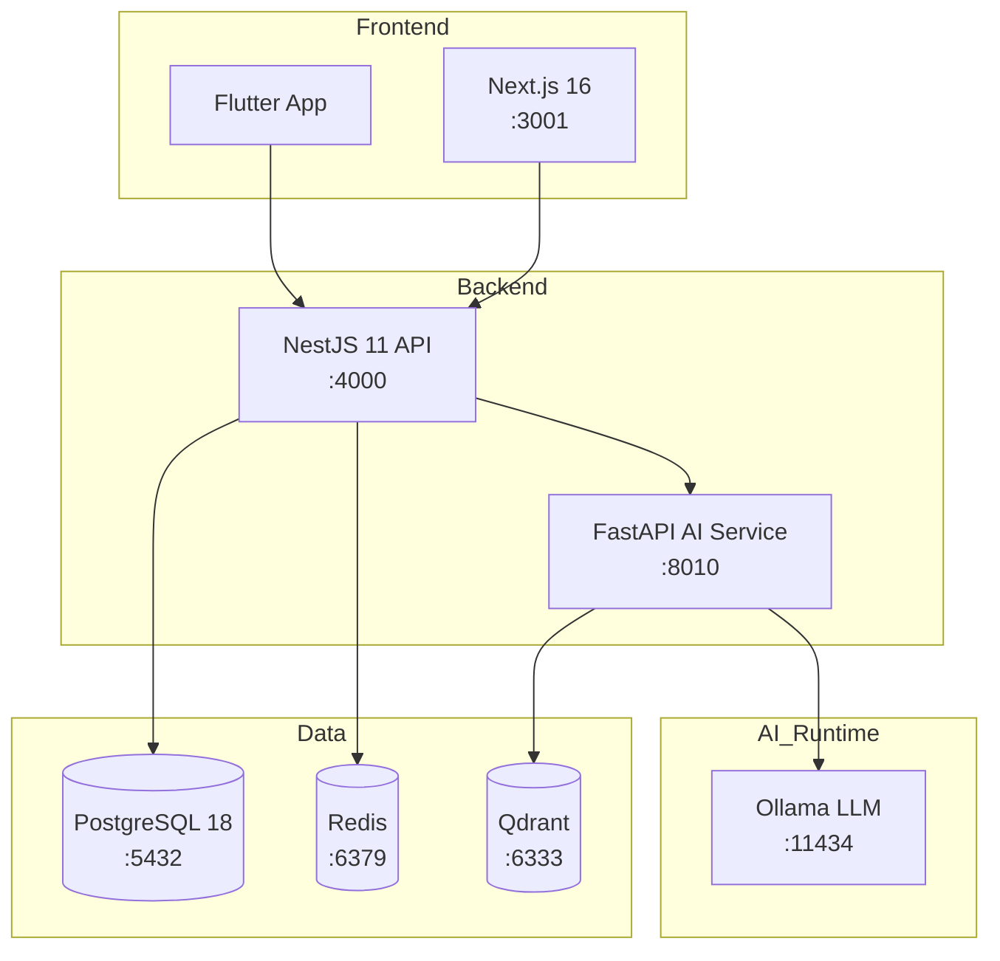

<p align="center">
  <h1 align="center">WanderViet — Vietnam Travel Platform</h1>
  <p align="center">
    <em>Full-stack travel platform built with modern monorepo architecture</em>
  </p>
</p>

<p align="center">
  <a href="https://github.com/JasonTM17/wanderviet/actions/workflows/ci.yml">
    
  </a>
  <a href="https://hub.docker.com/r/nguyenson1710/wanderviet-api">
    
  </a>
  <a href="https://hub.docker.com/r/nguyenson1710/wanderviet-web">
    
  </a>
  <a href="./LICENSE">
    
  </a>
  
  
</p>

<p align="center">
  <a href="./README.md">Tieng Viet</a> |
  <a href="#quick-start">Quick Start</a> |
  <a href="#documentation">Docs</a> |
  <a href="#api-documentation">API Docs</a>
</p>

---

<p align="center">
  
</p>

## Introduction

**WanderViet** is a comprehensive travel platform for the Vietnamese market, enabling users to search and book tours, hotels, and flights. The system integrates an AI chatbot for travel consultation powered by a fully local language model (no cloud API dependency).

### Key Features

- Tour, hotel, and flight booking with demo payment system
- AI Travel Assistant — travel consultation chatbot (Ollama + RAG)
- Admin Dashboard with analytics and booking management
- JWT authentication (15-min access token + 7-day refresh token)
- Flutter cross-platform mobile app
- E2E testing (Playwright) + Load testing (k6)
- Docker Compose — spin up the entire system with a single command

---

## UI Showcase

### Homepage — Hero Search & Flash Sale

<p align="center">
  
  &nbsp;
  
</p>

### Tour Detail — Gallery, Itinerary, Booking

<p align="center">
  
</p>

### Explore & Destination Search

<p align="center">
  
</p>

### Hotel Detail & Booking Flow

<p align="center">
  
  &nbsp;
  
</p>

### AI Trip Planner & Admin Dashboard

<p align="center">
  
  &nbsp;
  
</p>

---

## Tech Stack

| Layer          | Technology                          | Version      |
| -------------- | ----------------------------------- | ------------ |
| **Frontend**   | Next.js + TypeScript + Tailwind CSS | 16.x         |
| **Backend**    | NestJS + TypeScript                 | 11.x         |
| **Database**   | PostgreSQL + Prisma ORM             | 18 / 7.x     |
| **AI Service** | FastAPI + Ollama + Qdrant           | Python 3.12+ |
| **Mobile**     | Flutter + Dart                      | Latest       |
| **Monorepo**   | pnpm Workspaces + Turborepo         | 10.x / 2.x   |
| **Testing**    | Vitest + Playwright + k6            | Latest       |
| **CI/CD**      | GitHub Actions + Docker             | —            |
| **Cache**      | Redis                               | 7.x          |

---

## Architecture

```
wanderviet/
├── apps/
│   ├── api/            # NestJS 11 — REST API, Swagger at /api/docs
│   ├── web/            # Next.js 16 — Vietnamese-first frontend
│   ├── ai-service/     # FastAPI — Local RAG (Ollama + Qdrant)
│   └── mobile/         # Flutter — Mobile app
├── packages/
│   ├── shared/         # Shared TypeScript types & API contracts
│   ├── db/             # Prisma schema, migrations, seed data
│   └── config/         # Shared ESLint, TypeScript, build configs
├── infra/docker/       # Docker Compose (postgres, redis, qdrant, api, web, ai)
├── e2e/                # Playwright end-to-end tests
├── load-tests/         # k6 load test scripts
└── docs/               # ADRs, ER diagram, architecture notes
```



---

## Technical Highlights

| Aspect                  | Details                                                                  |
| ----------------------- | ------------------------------------------------------------------------ |
| **Local AI/RAG**        | Ollama LLM + Qdrant vector DB — no API keys, no cost                     |
| **True monorepo**       | pnpm workspaces + Turborepo — shared types, lint, build pipeline         |
| **Security**            | JWT rotation, rate limiting, path traversal protection, input validation |
| **Production Docker**   | Multi-stage builds, non-root containers, health checks                   |
| **Automated CI/CD**     | GitHub Actions: lint → test → build → push Docker images                 |
| **Multi-layer testing** | Unit (Vitest) + E2E (Playwright) + Load (k6)                             |
| **Design System**       | Custom Tailwind tokens, responsive mobile-first, accessibility           |
| **4 ADRs**              | Documented technical decisions (NestJS, Prisma, mock payment, monorepo)  |

---

## Prerequisites

| Software                | Minimum Version          |
| ----------------------- | ------------------------ |
| Node.js                 | >= 22.x                  |
| pnpm                    | >= 10.x                  |
| Docker & Docker Compose | Latest                   |
| PostgreSQL              | 18 (via Docker)          |
| Python                  | >= 3.12 (for AI service) |

---

## Quick Start

### 1. Clone the repository

```bash
git clone https://github.com/JasonTM17/wanderviet.git
cd wanderviet
```

### 2. Install dependencies

```bash
pnpm install
```

### 3. Configure environment

```bash
cp .env.example .env
# Edit .env with your database credentials and configuration
```

### 4. Start infrastructure (Docker)

```bash
docker compose -f infra/docker/docker-compose.yml up -d
```

### 5. Run database migrations & seed

```bash
pnpm --filter @vietwander/db prisma migrate dev
pnpm seed
```

### 6. Start development servers

```bash
pnpm dev
```

| Service    | URL                            |
| ---------- | ------------------------------ |
| Web        | http://localhost:3001          |
| API        | http://localhost:4000/api/v1   |
| Swagger    | http://localhost:4000/api/docs |
| AI Service | http://localhost:8010          |

---

## Demo Accounts

| Role  | Email                  | Password       |
| ----- | ---------------------- | -------------- |
| Admin | `admin@wanderviet.com` | `Admin@123456` |
| User  | `user@wanderviet.com`  | `User@123456`  |

> **Note:** The payment system is mock/demo only — no real transactions are processed.

---

## API Documentation

API documentation is auto-generated using Swagger/OpenAPI:

- **Swagger UI:** http://localhost:4000/api/docs
- **OpenAPI JSON:** http://localhost:4000/api/docs-json

---

## Documentation

| Document                                         | Description                    |
| ------------------------------------------------ | ------------------------------ |
| [Architecture](./docs/architecture.md)           | System architecture overview   |
| [Features](./docs/FEATURES.md)                   | Detailed feature documentation |
| [ADRs](./docs/adr/)                              | Architecture Decision Records  |
| [ER Diagram](./docs/er-diagram.md)               | Entity-Relationship diagram    |
| [Contributing](./CONTRIBUTING.md)                | Contribution guidelines        |
| [Changelog](./CHANGELOG.md)                      | Change history                 |
| [Release Checklist](./docs/release-checklist.md) | Release process                |

---

## Project Scale

```
41 web pages | 21 API modules | 10 AI endpoints | 12 mobile screens
```

| Feature Group | Pages                                                                                                     |
| ------------- | --------------------------------------------------------------------------------------------------------- |
| Booking       | Tour listing, Tour detail, Hotel detail, Flight search, Booking form, Payment, Success                    |
| AI            | AI Planner, Chat, Budget estimator, Personality quiz, Destination compare                                 |
| User          | Login, Register, Profile, Wishlist, My Bookings, Notifications, Loyalty                                   |
| Admin         | Dashboard, Users, Tours, Hotels, Destinations, Bookings, Coupons, Blogs, Reviews, Analytics, AI Knowledge |
| Explore       | Search, Map, Experiences, Trips                                                                           |

---

## Scripts

```bash
pnpm dev              # Start all dev servers
pnpm build            # Production build
pnpm lint             # ESLint + Prettier check
pnpm typecheck        # TypeScript strict check
pnpm test             # Vitest unit tests
pnpm e2e              # Playwright E2E tests
pnpm docker:up        # Docker Compose up
pnpm seed             # Seed database
```

---

## License

This project is distributed under the [MIT](./LICENSE) license.

Copyright (c) 2026 [Nguyen Son](https://github.com/JasonTM17)
