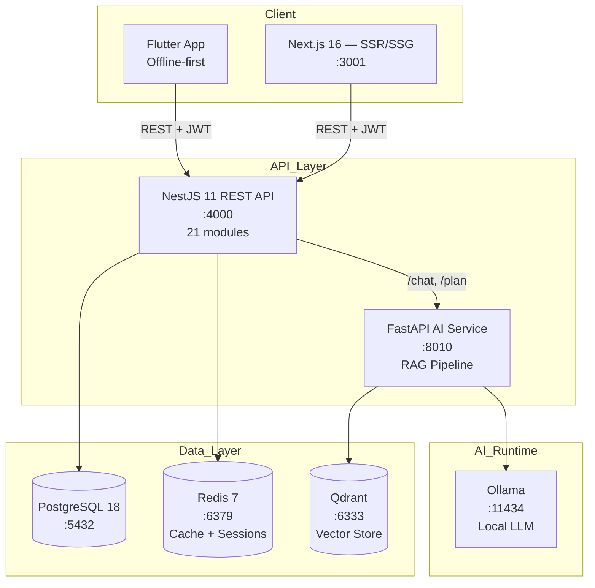

<p align="center">
  <h1 align="center">WanderViet — Nen Tang Du Lich Viet Nam</h1>
  <p align="center">
    <em>Full-stack travel platform | Monorepo | AI-powered | 41 trang | Production-ready</em>
  </p>
</p>

<p align="center">
  <a href="https://github.com/JasonTM17/ChillTravel_NextJS/actions/workflows/ci.yml">
    
  </a>
  <a href="https://hub.docker.com/r/nguyenson1710/wanderviet-api">
    
  </a>
  <a href="https://hub.docker.com/r/nguyenson1710/wanderviet-web">
    
  </a>
  
  
  
  
  <a href="./LICENSE">
    
  </a>
</p>

<p align="center">
  <a href="./README.en.md">English</a> |
  <a href="#cai-dat-nhanh">Cai dat</a> |
  <a href="#tai-lieu">Tai lieu</a> |
  <a href="#api-documentation">API Docs</a>
</p>

---

<p align="center">
  
</p>

## Gioi Thieu

**WanderViet** la nen tang du lich toan dien danh cho thi truong Viet Nam, cho phep nguoi dung tim kiem, dat tour, khach san va chuyen bay. He thong tich hop AI chatbot ho tro tu van du lich su dung mo hinh ngon ngu chay hoan toan local (Ollama + RAG), khong phu thuoc cloud API.

Du an duoc xay dung voi kien truc monorepo hien dai, ap dung cac best practices ve security, testing, CI/CD va containerization.

```
41 trang web | 21 API modules | 10 AI endpoints | 12 man hinh mobile
```

---

## Giao Dien

### Trang Chu

<p align="center">
  
  &nbsp;
  
</p>

### Dang Nhap & Xac Thuc

<p align="center">
  
</p>

### Tour Chi Tiet — Gallery, Lich Trinh, Dat Tour

<p align="center">
  
</p>

### Kham Pha Diem Den & Ban Do

<p align="center">
  
  &nbsp;
  
</p>

<p align="center">
  
</p>

### Khach San & Dat Phong

<p align="center">
  
  &nbsp;
  
</p>

### Tim Chuyen Bay

<p align="center">
  
</p>

### AI Travel Assistant

<p align="center">
  
  &nbsp;
  
</p>

<p align="center">
  
  &nbsp;
  
</p>

### Admin Dashboard — Analytics & Quan Ly

<p align="center">
  
</p>

---

## Tech Stack

| Layer           | Cong nghe                         | Phien ban    |
| --------------- | --------------------------------- | ------------ |
| **Frontend**    | Next.js + React 19 + Tailwind CSS | 16.x         |
| **Backend**     | NestJS + TypeScript               | 11.x         |
| **Database**    | PostgreSQL + Prisma ORM           | 18 / 7.x     |
| **AI Service**  | FastAPI + Ollama + Qdrant         | Python 3.12+ |
| **Mobile**      | Flutter + Dart + Riverpod         | 3.x          |
| **Monorepo**    | pnpm Workspaces + Turborepo       | 10.x / 2.x   |
| **Testing**     | Vitest + Playwright + k6          | Latest       |
| **CI/CD**       | GitHub Actions (7 jobs) + Docker  | —            |
| **Cache**       | Redis                             | 7.x          |
| **Vector DB**   | Qdrant                            | Latest       |
| **LLM Runtime** | Ollama                            | Latest       |

---

## Kien Truc He Thong

```
wanderviet/
├── apps/
│   ├── api/            # NestJS 11 — REST API (21 modules), Swagger tai /api/docs
│   ├── web/            # Next.js 16 — 41 trang, Vietnamese-first UI
│   ├── ai-service/     # FastAPI — Local RAG (Ollama + Qdrant), 10 endpoints
│   └── mobile/         # Flutter — 12 man hinh, offline-first
├── packages/
│   ├── shared/         # Shared TypeScript types & API contracts
│   ├── db/             # Prisma schema, migrations, seed data
│   └── config/         # Shared ESLint, TypeScript, build configs
├── infra/docker/       # Docker Compose (6 services) + Dockerfiles
├── e2e/                # Playwright E2E tests (4 critical flows)
├── load-tests/         # k6 load test scripts
└── docs/               # ADRs, ER diagram, architecture, features
```



---

## Diem Noi Bat Ky Thuat

| Khia canh                   | Chi tiet                                                                              |
| --------------------------- | ------------------------------------------------------------------------------------- |
| **AI/RAG chay local**       | Ollama LLM + Qdrant vector DB — khong can API key, khong mat phi, du lieu rieng tu    |
| **Monorepo thuc thu**       | pnpm workspaces + Turborepo — shared types, parallel builds, dependency graph         |
| **Security**                | JWT rotation (15p access / 7d refresh), rate limiting, CORS, helmet, input validation |
| **Docker production-ready** | Multi-stage builds, non-root user, health checks, layer caching                       |
| **CI/CD 7 jobs**            | typecheck, lint+test, security audit, gitleaks, E2E, Docker build, mobile             |
| **Testing da tang**         | Unit (Vitest) + E2E (Playwright) + Load (k6) + Property-based (fast-check)            |
| **Mobile offline-first**    | Flutter + Riverpod, local cache, sandbox bookings, offline AI fallback                |
| **Design System**           | Custom Tailwind tokens (tv-\*), responsive, WCAG accessible                           |
| **4 ADRs**                  | Ghi chep quyet dinh: NestJS, Prisma, mock payment, monorepo structure                 |

---

## Tinh Nang Chi Tiet

### Booking System

- Dat tour voi lich trinh chi tiet, gallery anh, danh gia
- Dat khach san voi bo loc gia, tien nghi, vi tri
- Tim chuyen bay voi so sanh gia
- He thong thanh toan demo (sandbox, khong giao dich that)
- Ma giam gia va chuong trinh loyalty

### AI Features

- **AI Trip Planner** — Lap lich trinh tu dong theo so ngay, ngan sach, so thich
- **Chat Assistant** — Hoi dap ve du lich, goi y dia diem, am thuc
- **Budget Estimator** — Uoc tinh chi phi theo diem den va thoi gian
- **Personality Quiz** — Goi y phong cach du lich phu hop
- **Destination Compare** — So sanh nhieu diem den

### Admin Dashboard

- Bieu do doanh thu (AreaChart), booking status (PieChart)
- Top tours ranking (BarChart)
- Quan ly: users, tours, hotels, destinations, bookings, coupons, blogs, reviews
- AI Knowledge base management
- Contact/support ticket system

### Mobile App (Flutter)

- Offline-first architecture voi local cache
- Sandbox booking (khong giao dich that)
- AI chat fallback khi mat mang
- QR code ve dien tu demo
- Wishlist va itinerary planner

---

## Yeu Cau He Thong

| Phan mem                | Phien ban toi thieu      |
| ----------------------- | ------------------------ |
| Node.js                 | >= 22.x                  |
| pnpm                    | >= 10.x                  |
| Docker & Docker Compose | Latest                   |
| PostgreSQL              | 18 (qua Docker)          |
| Python                  | >= 3.12 (cho AI service) |
| Flutter                 | >= 3.x (cho mobile)      |

---

## Cai Dat Nhanh

### 1. Clone repository

```bash
git clone https://github.com/JasonTM17/ChillTravel_NextJS.git wanderviet
cd wanderviet
```

### 2. Cai dat dependencies

```bash
pnpm install
```

### 3. Cau hinh moi truong

```bash
cp .env.example .env
# Chinh sua .env voi thong tin database va cac config can thiet
```

### 4. Khoi chay infrastructure (Docker)

```bash
docker compose -f infra/docker/docker-compose.yml up -d
```

Dich vu se khoi chay: PostgreSQL, Redis, Qdrant, Ollama

### 5. Chay database migrations & seed

```bash
pnpm --filter @vietwander/db prisma migrate dev
pnpm seed
```

### 6. Khoi chay development servers

```bash
pnpm dev
```

| Service    | URL                            |
| ---------- | ------------------------------ |
| Web        | http://localhost:3001          |
| API        | http://localhost:4000/api/v1   |
| Swagger    | http://localhost:4000/api/docs |
| AI Service | http://localhost:8010          |

---

## Docker

### Chay toan bo he thong

```bash
docker compose -f infra/docker/docker-compose.yml up -d
```

### Docker Images tren Docker Hub

| Image | Link                                                                                  |
| ----- | ------------------------------------------------------------------------------------- |
| API   | [nguyenson1710/wanderviet-api](https://hub.docker.com/r/nguyenson1710/wanderviet-api) |
| Web   | [nguyenson1710/wanderviet-web](https://hub.docker.com/r/nguyenson1710/wanderviet-web) |

### Build local

```bash
docker compose -f infra/docker/docker-compose.yml build
```

---

## Tai Khoan Demo

| Vai tro | Email                  | Mat khau       |
| ------- | ---------------------- | -------------- |
| Admin   | `admin@wanderviet.com` | `Admin@123456` |
| User    | `user@wanderviet.com`  | `User@123456`  |

> **Luu y:** He thong thanh toan la mock/demo — khong xu ly giao dich that.

---

## API Documentation

API documentation duoc tao tu dong bang Swagger/OpenAPI:

- **Swagger UI:** http://localhost:4000/api/docs
- **OpenAPI JSON:** http://localhost:4000/api/docs-json

### API Modules (21)

| Module        | Mo ta                                              |
| ------------- | -------------------------------------------------- |
| Auth          | Dang ky, dang nhap, refresh token, forgot password |
| Users         | CRUD users, profile, avatar upload                 |
| Tours         | CRUD tours, search, filter, pagination             |
| Hotels        | CRUD hotels, rooms, amenities                      |
| Flights       | Tim chuyen bay, so sanh gia                        |
| Bookings      | Dat tour/hotel/flight, trang thai, lich su         |
| Payments      | Mock payment processing, refund                    |
| Reviews       | Danh gia, rating, moderation                       |
| Destinations  | Diem den, categories, popular                      |
| Coupons       | Ma giam gia, validation, usage tracking            |
| Blogs         | Bai viet, categories, comments                     |
| Contacts      | Lien he, support tickets                           |
| Notifications | Push notifications, email                          |
| Loyalty       | Diem thuong, tier, rewards                         |
| Analytics     | Dashboard metrics, revenue, trends                 |
| Upload        | File upload (images, documents)                    |
| Health        | Health check endpoints                             |
| AI Chat       | Proxy to AI service                                |
| AI Planner    | Trip planning endpoints                            |
| AI Budget     | Budget estimation                                  |
| AI Knowledge  | RAG knowledge base management                      |

---

## Testing

```bash
# Unit tests
pnpm test

# Type checking
pnpm typecheck

# Linting
pnpm lint

# E2E tests (can Playwright browsers)
pnpm e2e

# Load testing
pnpm load-test

# AI service tests
pnpm ai:test
```

### CI Pipeline (7 jobs)

| Job              | Mo ta                                    |
| ---------------- | ---------------------------------------- |
| `web-api-ai`     | Lint + Unit tests + Build (Node 22 & 24) |
| `typecheck`      | TypeScript strict mode check             |
| `security-audit` | pnpm audit (high/critical)               |
| `gitleaks`       | Secret scanning                          |
| `mobile`         | Flutter analyze + test                   |
| `e2e`            | Playwright end-to-end tests              |
| `docker-build`   | Build Docker images (on push to main)    |

---

## Tai Lieu

| Tai lieu                                         | Mo ta                                  |
| ------------------------------------------------ | -------------------------------------- |
| [Architecture](./docs/architecture.md)           | Tong quan kien truc he thong           |
| [Features](./docs/FEATURES.md)                   | Chi tiet 41 trang va tinh nang         |
| [ADRs](./docs/adr/)                              | Architecture Decision Records (4 ADRs) |
| [ER Diagram](./docs/er-diagram.md)               | So do quan he thuc the                 |
| [Contributing](./CONTRIBUTING.md)                | Huong dan dong gop                     |
| [Changelog](./CHANGELOG.md)                      | Lich su thay doi                       |
| [Release Checklist](./docs/release-checklist.md) | Quy trinh release                      |

---

## Cau Truc Trang

| Nhom        | Trang                                                                                                     |
| ----------- | --------------------------------------------------------------------------------------------------------- |
| **Booking** | Tour listing, Tour detail, Hotel detail, Flight search, Booking form, Payment, Success                    |
| **AI**      | AI Planner, Chat, Budget estimator, Personality quiz, Destination compare                                 |
| **User**    | Login, Register, Profile, Wishlist, My Bookings, Notifications, Loyalty                                   |
| **Admin**   | Dashboard, Users, Tours, Hotels, Destinations, Bookings, Coupons, Blogs, Reviews, Analytics, AI Knowledge |
| **Explore** | Search, Map, Experiences, Trips, Destinations                                                             |

---

## Scripts

```bash
pnpm dev              # Chay tat ca dev servers (Turborepo)
pnpm build            # Build production
pnpm lint             # ESLint + Prettier check
pnpm typecheck        # TypeScript strict check
pnpm test             # Vitest unit tests
pnpm e2e              # Playwright E2E tests
pnpm docker:up        # Docker Compose up
pnpm docker:down      # Docker Compose down
pnpm docker:logs      # Xem logs
pnpm seed             # Seed database
pnpm ai:test          # Python AI service tests
pnpm load-test        # k6 load testing
pnpm storybook        # Component storybook
pnpm format           # Prettier format all
```

---

## Packages

| Package              | Mo ta                           | Path              |
| -------------------- | ------------------------------- | ----------------- |
| `@vietwander/web`    | Next.js 16 frontend (41 trang)  | `apps/web`        |
| `@vietwander/api`    | NestJS 11 REST API (21 modules) | `apps/api`        |
| `@vietwander/e2e`    | Playwright E2E tests            | `e2e`             |
| `@vietwander/shared` | Shared types & API contracts    | `packages/shared` |
| `@vietwander/db`     | Prisma schema, migrations, seed | `packages/db`     |
| `@vietwander/config` | Shared ESLint, TS configs       | `packages/config` |
| `ai-service`         | FastAPI + Ollama + Qdrant       | `apps/ai-service` |
| `mobile`             | Flutter app (wanderviet)        | `apps/mobile`     |

---

## License

Du an duoc phan phoi duoi giay phep [MIT](./LICENSE).

Copyright (c) 2026 [Nguyen Son](https://github.com/JasonTM17)
