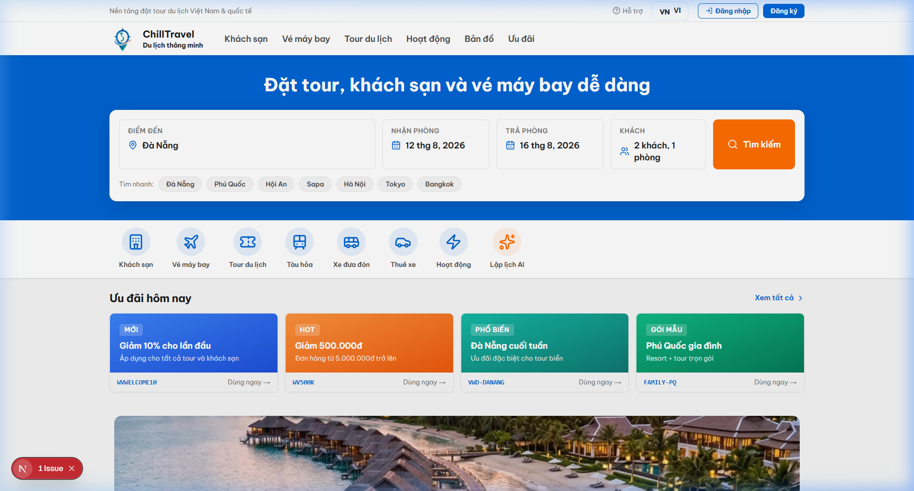
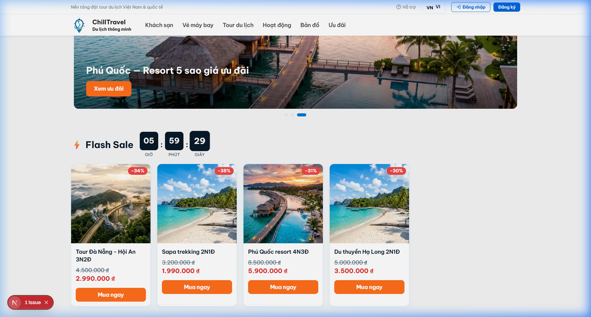
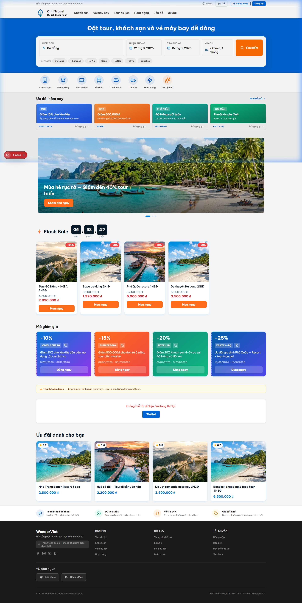
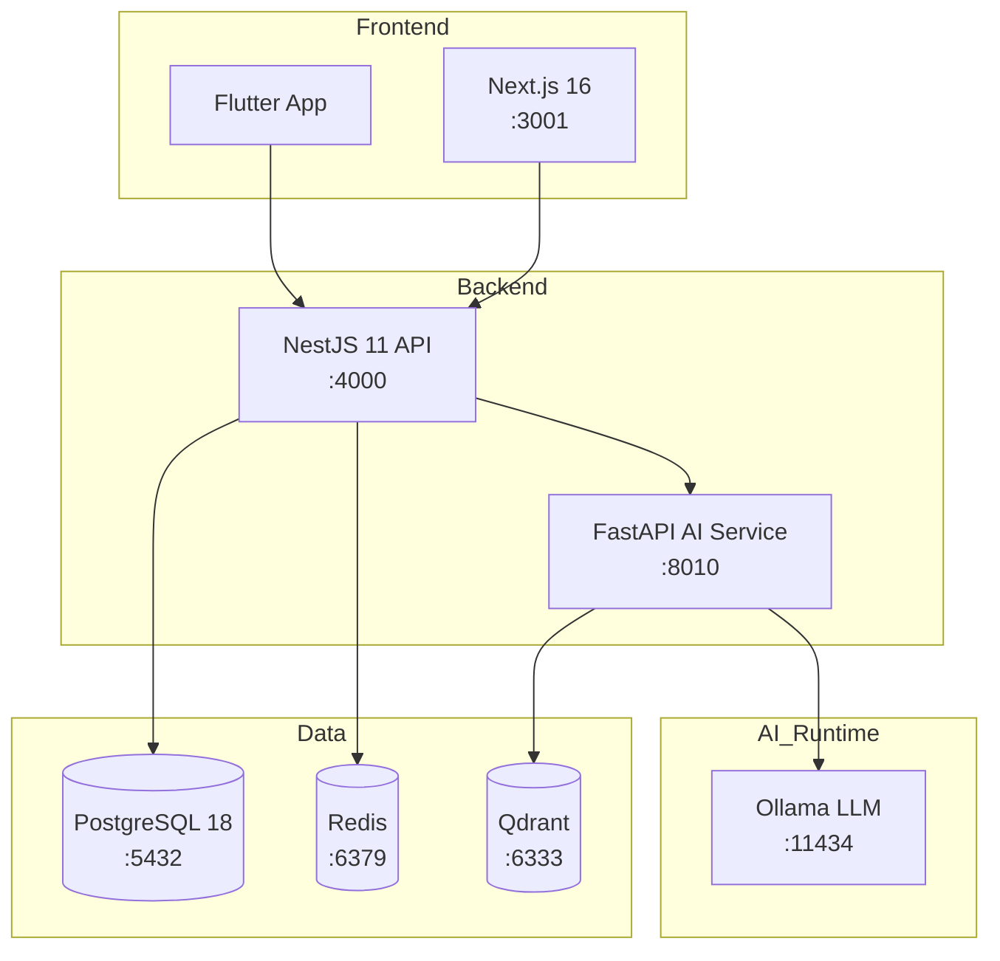

<p align="center">
  <h1 align="center">WanderViet — Nền Tảng Du Lịch Việt Nam</h1>
  <p align="center">
    <em>Full-stack travel platform xây dựng với kiến trúc monorepo hiện đại</em>
  </p>
</p>

<p align="center">
  <a href="https://github.com/JasonTM17/ChillTravel_NextJS/actions/workflows/ci.yml">
    
  </a>
  <a href="https://hub.docker.com/r/nguyenson1710/wanderviet-api">
    
  </a>
  <a href="https://hub.docker.com/r/nguyenson1710/wanderviet-web">
    
  </a>
  <a href="./LICENSE">
    
  </a>
</p>

<p align="center">
  <a href="./README.en.md">English</a> |
  <a href="#cài-đặt-nhanh">Cài đặt</a> |
  <a href="#tài-liệu">Tài liệu</a> |
  <a href="#api-documentation">API Docs</a>
</p>

---

<p align="center">
  
</p>

## Giao diện Nổi bật

Dự án được thiết kế với chuẩn UI/UX cao cấp (Premium Booking Platform), sử dụng Design System tinh tế và hiện đại.

<p align="center">
  
  &nbsp;
  
</p>

---

## Giới Thiệu

**WanderViet** là nền tảng du lịch toàn diện dành cho thị trường Việt Nam, cho phép người dùng tìm kiếm, đặt tour, khách sạn và chuyến bay. Hệ thống tích hợp AI chatbot hỗ trợ tư vấn du lịch sử dụng mô hình ngôn ngữ chạy hoàn toàn local (không phụ thuộc cloud API).

### Tính Năng Chính

- Đặt tour, khách sạn, chuyến bay với hệ thống thanh toán demo
- AI Travel Assistant — chatbot tư vấn du lịch (Ollama + RAG)
- Admin Dashboard với analytics và quản lý booking
- Xác thực JWT (access token 15 phút + refresh token 7 ngày)
- Ứng dụng mobile Flutter cross-platform
- E2E testing (Playwright) + Load testing (k6)
- Docker Compose — khởi chạy toàn bộ hệ thống bằng 1 lệnh

---

## Tech Stack

| Layer          | Công nghệ                           | Phiên bản    |
| -------------- | ----------------------------------- | ------------ |
| **Frontend**   | Next.js + TypeScript + Tailwind CSS | 16.x         |
| **Backend**    | NestJS + TypeScript                 | 11.x         |
| **Database**   | PostgreSQL + Prisma ORM             | 18 / 7.x     |
| **AI Service** | FastAPI + Ollama + Qdrant           | Python 3.12+ |
| **Mobile**     | Flutter + Dart                      | Latest       |
| **Monorepo**   | pnpm Workspaces + Turborepo         | 10.x / 2.x   |
| **Testing**    | Vitest + Playwright + k6            | Latest       |
| **CI/CD**      | GitHub Actions + Docker             | —            |
| **Cache**      | Redis                               | 7.x          |

---

## Kiến Trúc

```
wanderviet/
├── apps/
│   ├── api/            # NestJS 11 — REST API, Swagger tại /api/docs
│   ├── web/            # Next.js 16 — Frontend Vietnamese-first
│   ├── ai-service/     # FastAPI — Local RAG (Ollama + Qdrant)
│   └── mobile/         # Flutter — Mobile app
├── packages/
│   ├── shared/         # Shared TypeScript types & API contracts
│   ├── db/             # Prisma schema, migrations, seed data
│   └── config/         # Shared ESLint, TypeScript, build configs
├── infra/docker/       # Docker Compose (postgres, redis, qdrant, api, web, ai)
├── e2e/                # Playwright end-to-end tests
├── load-tests/         # k6 load test scripts
└── docs/               # ADRs, ER diagram, architecture notes
```



---

## Yêu Cầu Hệ Thống

| Phần mềm                | Phiên bản tối thiểu      |
| ----------------------- | ------------------------ |
| Node.js                 | >= 22.x                  |
| pnpm                    | >= 10.x                  |
| Docker & Docker Compose | Latest                   |
| PostgreSQL              | 18 (qua Docker)          |
| Python                  | >= 3.12 (cho AI service) |

---

## Cài Đặt Nhanh

### 1. Clone repository

```bash
git clone https://github.com/JasonTM17/ChillTravel_NextJS.git
cd ChillTravel_NextJS
```

### 2. Cài đặt dependencies

```bash
pnpm install
```

### 3. Cấu hình môi trường

```bash
cp .env.example .env
# Chỉnh sửa .env với thông tin database và các config cần thiết
```

### 4. Khởi chạy infrastructure (Docker)

```bash
docker compose -f infra/docker/docker-compose.yml up -d
```

### 5. Chạy database migrations & seed

```bash
pnpm --filter @vietwander/db prisma migrate dev
pnpm seed
```

### 6. Khởi chạy development servers

```bash
pnpm dev
```

| Service    | URL                            |
| ---------- | ------------------------------ |
| Web        | http://localhost:3001          |
| API        | http://localhost:4000/api/v1   |
| Swagger    | http://localhost:4000/api/docs |
| AI Service | http://localhost:8010          |

---

## Tài Khoản Demo

| Vai trò | Email                  | Mật khẩu       |
| ------- | ---------------------- | -------------- |
| Admin   | `admin@wanderviet.com` | `Admin@123456` |
| User    | `user@wanderviet.com`  | `User@123456`  |

> **Lưu ý:** Hệ thống thanh toán là mock/demo — không xử lý giao dịch thật.

---

## API Documentation

API documentation được tạo tự động bằng Swagger/OpenAPI:

- **Swagger UI:** http://localhost:4000/api/docs
- **OpenAPI JSON:** http://localhost:4000/api/docs-json

---

## Tài Liệu

| Tài liệu                                         | Mô tả                         |
| ------------------------------------------------ | ----------------------------- |
| [Architecture](./docs/architecture.md)           | Tổng quan kiến trúc hệ thống  |
| [ADRs](./docs/adr/)                              | Architecture Decision Records |
| [ER Diagram](./docs/er-diagram.md)               | Sơ đồ quan hệ thực thể        |
| [Contributing](./CONTRIBUTING.md)                | Hướng dẫn đóng góp            |
| [Changelog](./CHANGELOG.md)                      | Lịch sử thay đổi              |
| [Release Checklist](./docs/release-checklist.md) | Quy trình release             |

---

## License

Dự án được phân phối dưới giấy phép [MIT](./LICENSE).

Copyright (c) 2026 [Nguyen Son](https://github.com/JasonTM17)
