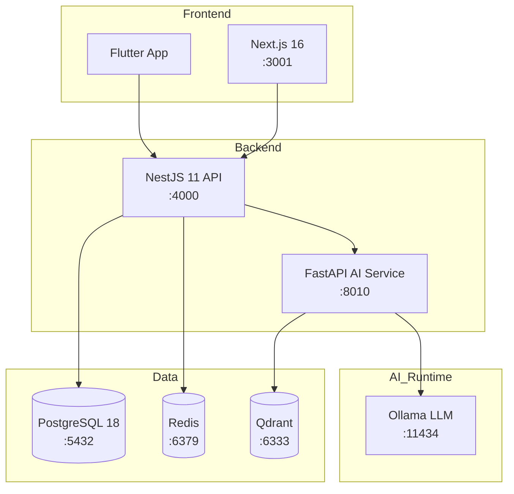

<p align="center">
  <h1 align="center">WanderViet — Nền Tảng Du Lịch Việt Nam</h1>
  <p align="center">
    <em>Full-stack travel platform xây dựng với kiến trúc monorepo hiện đại</em>
  </p>
</p>

<p align="center">
  <a href="https://github.com/JasonTM17/wanderviet/actions/workflows/ci.yml">
    
  </a>
  <a href="https://hub.docker.com/r/nguyenson1710/wanderviet-api">
    
  </a>
  <a href="https://hub.docker.com/r/nguyenson1710/wanderviet-web">
    
  </a>
  <a href="./LICENSE">
    
  </a>
  
  
</p>

<p align="center">
  <a href="./README.en.md">English</a> |
  <a href="#cài-đặt-nhanh">Cai dat</a> |
  <a href="#tài-liệu">Tai lieu</a> |
  <a href="#api-documentation">API Docs</a>
</p>

---

<p align="center">
  
</p>

## Gioi Thieu

**WanderViet** la nen tang du lich toan dien danh cho thi truong Viet Nam, cho phep nguoi dung tim kiem, dat tour, khach san va chuyen bay. He thong tich hop AI chatbot ho tro tu van du lich su dung mo hinh ngon ngu chay hoan toan local (khong phu thuoc cloud API).

### Tinh Nang Chinh

- Dat tour, khach san, chuyen bay voi he thong thanh toan demo
- AI Travel Assistant — chatbot tu van du lich (Ollama + RAG)
- Admin Dashboard voi analytics va quan ly booking
- Xac thuc JWT (access token 15 phut + refresh token 7 ngay)
- Ung dung mobile Flutter cross-platform
- E2E testing (Playwright) + Load testing (k6)
- Docker Compose — khoi chay toan bo he thong bang 1 lenh

---

## Giao Dien

### Trang chu — Hero Search & Flash Sale

<p align="center">
  
  &nbsp;
  
</p>

### Tour Chi Tiet — Gallery, Lich Trinh, Booking

<p align="center">
  
</p>

### Tim Kiem & Kham Pha Diem Den

<p align="center">
  
</p>

### Khach San — Photo Gallery & Dat Phong

<p align="center">
  
  &nbsp;
  
</p>

### AI Trip Planner & Admin Dashboard

<p align="center">
  
  &nbsp;
  
</p>

---

## Tech Stack

| Layer          | Cong nghe                           | Phien ban    |
| -------------- | ----------------------------------- | ------------ |
| **Frontend**   | Next.js + TypeScript + Tailwind CSS | 16.x         |
| **Backend**    | NestJS + TypeScript                 | 11.x         |
| **Database**   | PostgreSQL + Prisma ORM             | 18 / 7.x     |
| **AI Service** | FastAPI + Ollama + Qdrant           | Python 3.12+ |
| **Mobile**     | Flutter + Dart                      | Latest       |
| **Monorepo**   | pnpm Workspaces + Turborepo         | 10.x / 2.x   |
| **Testing**    | Vitest + Playwright + k6            | Latest       |
| **CI/CD**      | GitHub Actions + Docker             | —            |
| **Cache**      | Redis                               | 7.x          |

---

## Kien Truc

```
wanderviet/
├── apps/
│   ├── api/            # NestJS 11 — REST API, Swagger tai /api/docs
│   ├── web/            # Next.js 16 — Frontend Vietnamese-first
│   ├── ai-service/     # FastAPI — Local RAG (Ollama + Qdrant)
│   └── mobile/         # Flutter — Mobile app
├── packages/
│   ├── shared/         # Shared TypeScript types & API contracts
│   ├── db/             # Prisma schema, migrations, seed data
│   └── config/         # Shared ESLint, TypeScript, build configs
├── infra/docker/       # Docker Compose (postgres, redis, qdrant, api, web, ai)
├── e2e/                # Playwright end-to-end tests
├── load-tests/         # k6 load test scripts
└── docs/               # ADRs, ER diagram, architecture notes
```



---

## Diem Noi Bat Ky Thuat

| Khia canh                   | Chi tiet                                                                 |
| --------------------------- | ------------------------------------------------------------------------ |
| **AI/RAG hoat dong local**  | Ollama LLM + Qdrant vector DB — khong can API key, khong mat phi         |
| **Monorepo thuc thu**       | pnpm workspaces + Turborepo — shared types, lint, build pipeline         |
| **Security**                | JWT rotation, rate limiting, path traversal protection, input validation |
| **Docker production-ready** | Multi-stage builds, non-root containers, health checks                   |
| **CI/CD tu dong**           | GitHub Actions: lint → test → build → push Docker images                 |
| **Testing da tang**         | Unit (Vitest) + E2E (Playwright) + Load (k6)                             |
| **Design System**           | Custom Tailwind tokens, responsive mobile-first, accessibility           |
| **4 ADRs**                  | Ghi chep quyet dinh ky thuat (NestJS, Prisma, mock payment, monorepo)    |

---

## Yeu Cau He Thong

| Phan mem                | Phien ban toi thieu      |
| ----------------------- | ------------------------ |
| Node.js                 | >= 22.x                  |
| pnpm                    | >= 10.x                  |
| Docker & Docker Compose | Latest                   |
| PostgreSQL              | 18 (qua Docker)          |
| Python                  | >= 3.12 (cho AI service) |

---

## Cai Dat Nhanh

### 1. Clone repository

```bash
git clone https://github.com/JasonTM17/wanderviet.git
cd wanderviet
```

### 2. Cai dat dependencies

```bash
pnpm install
```

### 3. Cau hinh moi truong

```bash
cp .env.example .env
# Chinh sua .env voi thong tin database va cac config can thiet
```

### 4. Khoi chay infrastructure (Docker)

```bash
docker compose -f infra/docker/docker-compose.yml up -d
```

### 5. Chay database migrations & seed

```bash
pnpm --filter @vietwander/db prisma migrate dev
pnpm seed
```

### 6. Khoi chay development servers

```bash
pnpm dev
```

| Service    | URL                            |
| ---------- | ------------------------------ |
| Web        | http://localhost:3001          |
| API        | http://localhost:4000/api/v1   |
| Swagger    | http://localhost:4000/api/docs |
| AI Service | http://localhost:8010          |

---

## Tai Khoan Demo

| Vai tro | Email                  | Mat khau       |
| ------- | ---------------------- | -------------- |
| Admin   | `admin@wanderviet.com` | `Admin@123456` |
| User    | `user@wanderviet.com`  | `User@123456`  |

> **Luu y:** He thong thanh toan la mock/demo — khong xu ly giao dich that.

---

## API Documentation

API documentation duoc tao tu dong bang Swagger/OpenAPI:

- **Swagger UI:** http://localhost:4000/api/docs
- **OpenAPI JSON:** http://localhost:4000/api/docs-json

---

## Tai Lieu

| Tai lieu                                         | Mo ta                         |
| ------------------------------------------------ | ----------------------------- |
| [Architecture](./docs/architecture.md)           | Tong quan kien truc he thong  |
| [Features](./docs/FEATURES.md)                   | Chi tiet tinh nang            |
| [ADRs](./docs/adr/)                              | Architecture Decision Records |
| [ER Diagram](./docs/er-diagram.md)               | So do quan he thuc the        |
| [Contributing](./CONTRIBUTING.md)                | Huong dan dong gop            |
| [Changelog](./CHANGELOG.md)                      | Lich su thay doi              |
| [Release Checklist](./docs/release-checklist.md) | Quy trinh release             |

---

## Cau Truc Du An

```
41 trang web | 21 API modules | 10 AI endpoints | 12 man hinh mobile
```

| Nhom tinh nang | Trang                                                                                                     |
| -------------- | --------------------------------------------------------------------------------------------------------- |
| Booking        | Tour listing, Tour detail, Hotel detail, Flight search, Booking form, Payment, Success                    |
| AI             | AI Planner, Chat, Budget estimator, Personality quiz, Destination compare                                 |
| User           | Login, Register, Profile, Wishlist, My Bookings, Notifications, Loyalty                                   |
| Admin          | Dashboard, Users, Tours, Hotels, Destinations, Bookings, Coupons, Blogs, Reviews, Analytics, AI Knowledge |
| Explore        | Search, Map, Experiences, Trips                                                                           |

---

## Scripts

```bash
pnpm dev              # Chay tat ca dev servers
pnpm build            # Build production
pnpm lint             # ESLint + Prettier check
pnpm typecheck        # TypeScript strict check
pnpm test             # Vitest unit tests
pnpm e2e              # Playwright E2E tests
pnpm docker:up        # Docker Compose up
pnpm seed             # Seed database
```

---

## License

Du an duoc phan phoi duoi giay phep [MIT](./LICENSE).

Copyright (c) 2026 [Nguyen Son](https://github.com/JasonTM17)
