<p align="center">
  <h1 align="center">WanderViet — Nền Tảng Du Lịch Việt Nam</h1>
  <p align="center">
    <em>Full-stack travel platform | Monorepo | AI-powered | 41 trang | Production-ready</em>
  </p>
</p>

<p align="center">
  <a href="https://github.com/JasonTM17/ChillTravel_NextJS/actions/workflows/ci.yml">
    
  </a>
  <a href="https://hub.docker.com/r/nguyenson1710/wanderviet-api">
    
  </a>
  <a href="https://hub.docker.com/r/nguyenson1710/wanderviet-web">
    
  </a>
  
  
  
  
  <a href="./LICENSE">
    
  </a>
</p>

<p align="center">
  <a href="./README.en.md">English</a> |
  <a href="#cài-đặt-nhanh">Cài đặt</a> |
  <a href="#tài-liệu">Tài liệu</a> |
  <a href="#api-documentation">API Docs</a>
</p>

---

<p align="center">
  
</p>

## Giới Thiệu

**WanderViet** là nền tảng du lịch toàn diện dành cho thị trường Việt Nam, cho phép người dùng tìm kiếm, đặt tour, khách sạn và chuyến bay. Hệ thống tích hợp AI chatbot hỗ trợ tư vấn du lịch sử dụng mô hình ngôn ngữ chạy hoàn toàn local (Ollama + RAG), không phụ thuộc cloud API.

Dự án được xây dựng với kiến trúc monorepo hiện đại, áp dụng các best practices về security, testing, CI/CD và containerization.

```
41 trang web | 21 API modules | 10 AI endpoints | 12 màn hình mobile
```

---

## Giao Diện

### Trang Chủ

<p align="center">
  
  &nbsp;
  
</p>

### Đăng Nhập & Xác Thực

<p align="center">
  
</p>

### Chi Tiết Tour — Gallery, Lịch Trình, Đặt Tour

<p align="center">
  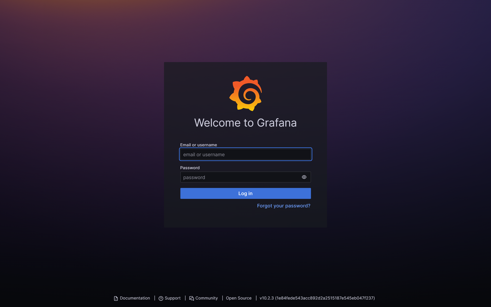
</p>

### Khám Phá Điểm Đến & Bản Đồ

<p align="center">
  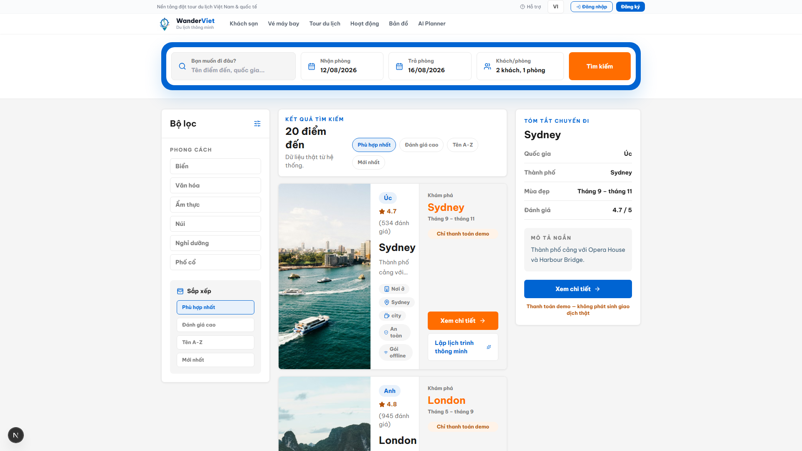
  &nbsp;
  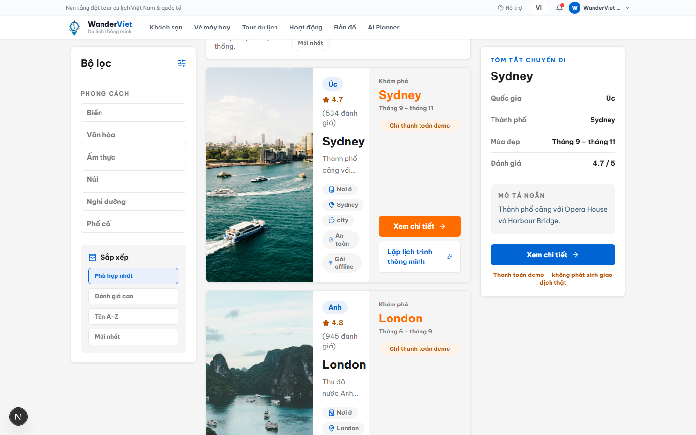
</p>

<p align="center">
  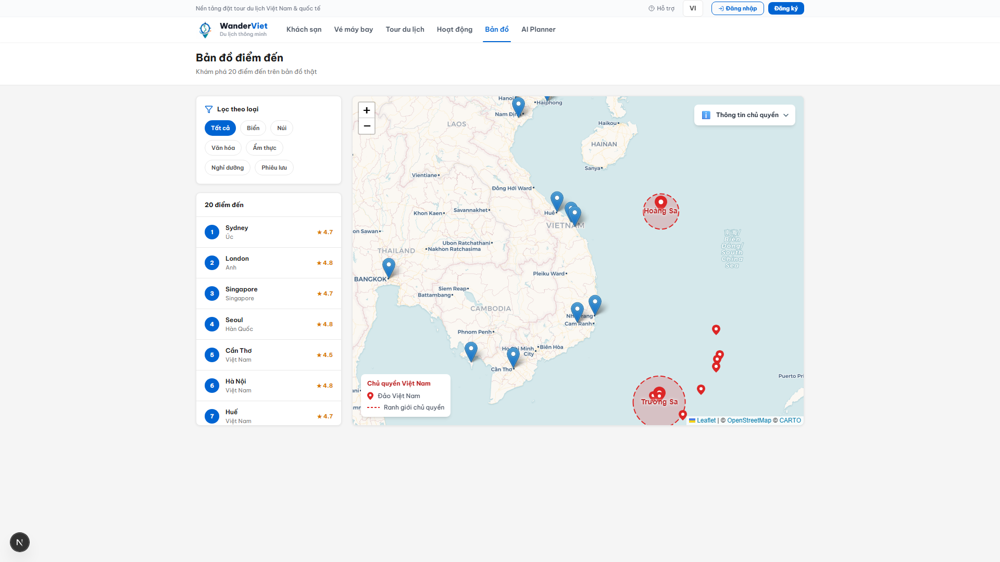
</p>

### Khách Sạn & Đặt Phòng

<p align="center">
  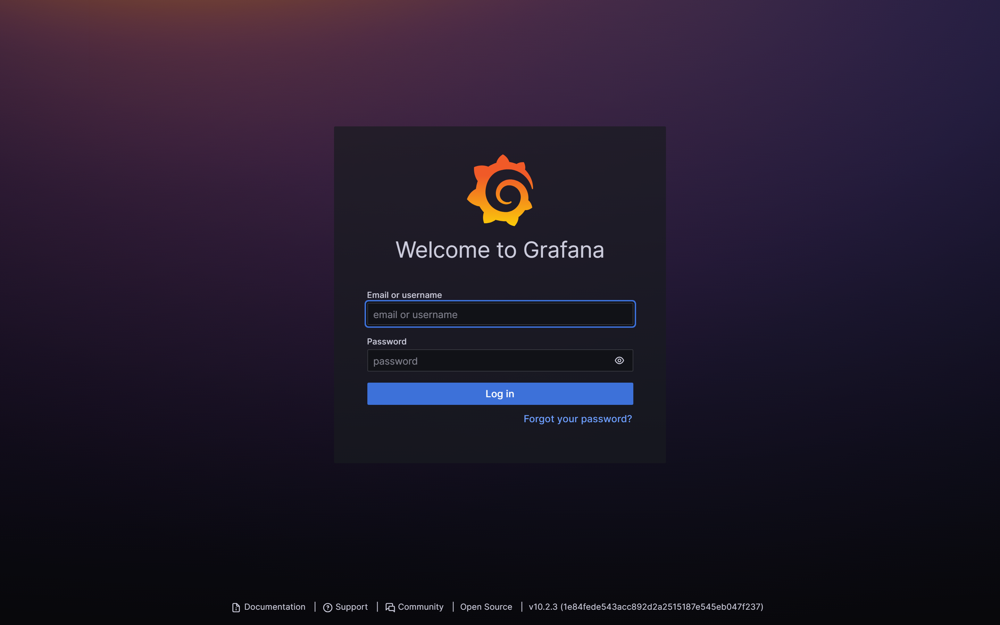
  &nbsp;
  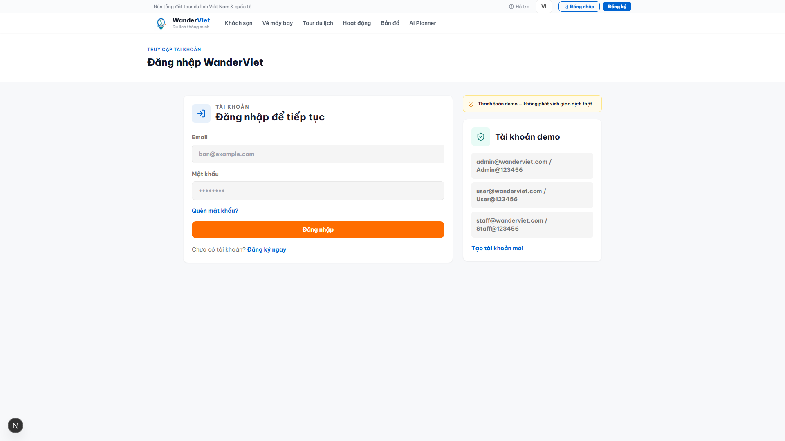
</p>

### Tìm Chuyến Bay

<p align="center">
  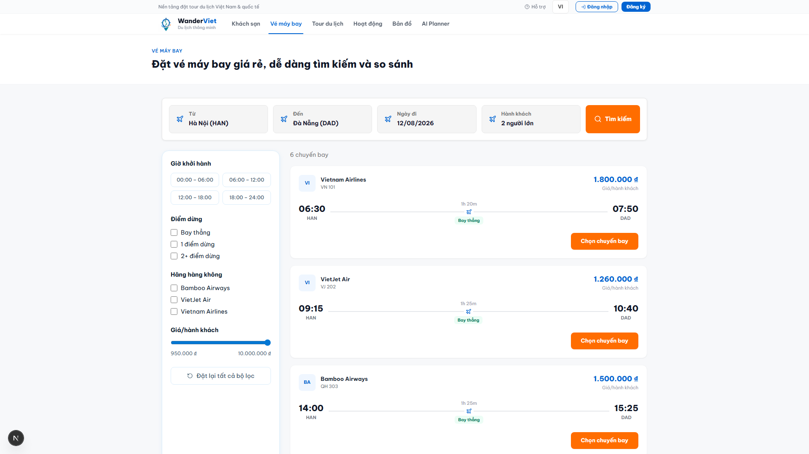
</p>

### AI Travel Assistant

<p align="center">
  
  &nbsp;
  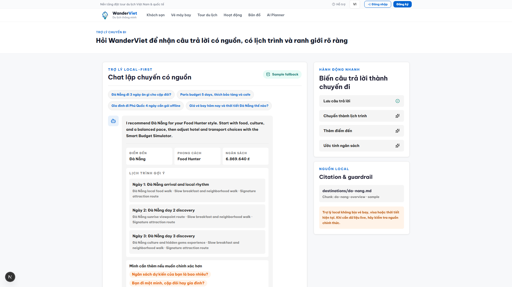
</p>

<p align="center">
  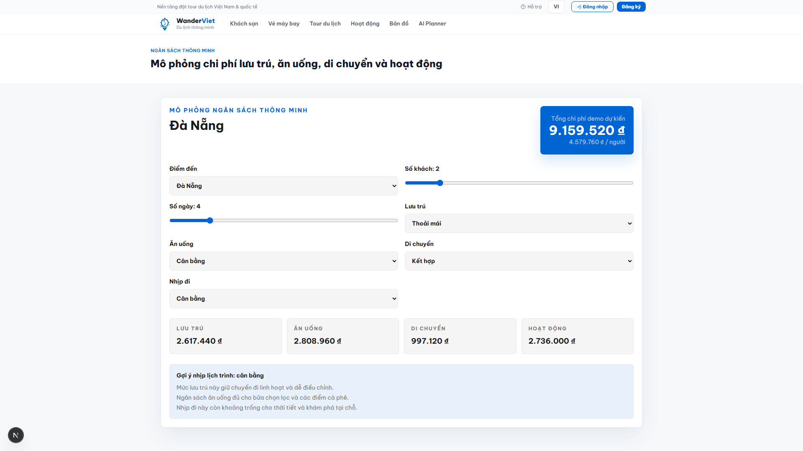
  &nbsp;
  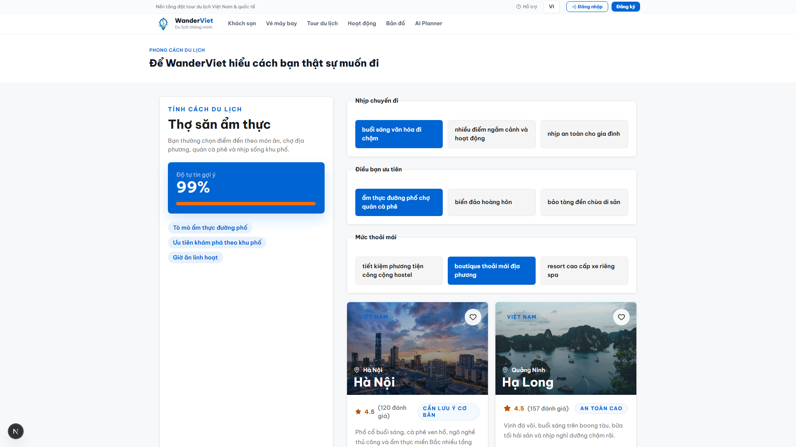
</p>

### Admin Dashboard — Phân Tích & Quản Lý

<p align="center">
  
</p>

---

## Tech Stack

| Tầng            | Công nghệ                         | Phiên bản    |
| --------------- | --------------------------------- | ------------ |
| **Frontend**    | Next.js + React 19 + Tailwind CSS | 16.x         |
| **Backend**     | NestJS + TypeScript               | 11.x         |
| **Database**    | PostgreSQL + Prisma ORM           | 18 / 7.x     |
| **AI Service**  | FastAPI + Ollama + Qdrant         | Python 3.12+ |
| **Mobile**      | Flutter + Dart + Riverpod         | 3.x          |
| **Monorepo**    | pnpm Workspaces + Turborepo       | 10.x / 2.x   |
| **Testing**     | Vitest + Playwright + k6          | Latest       |
| **CI/CD**       | GitHub Actions (7 jobs) + Docker  | —            |
| **Cache**       | Redis                             | 7.x          |
| **Vector DB**   | Qdrant                            | Latest       |
| **LLM Runtime** | Ollama                            | Latest       |

---

## Kiến Trúc Hệ Thống

```
wanderviet/
├── apps/
│   ├── api/            # NestJS 11 — REST API (21 modules), Swagger tại /api/docs
│   ├── web/            # Next.js 16 — 41 trang, Vietnamese-first UI
│   ├── ai-service/     # FastAPI — Local RAG (Ollama + Qdrant), 10 endpoints
│   └── mobile/         # Flutter — 12 màn hình, offline-first
├── packages/
│   ├── shared/         # Shared TypeScript types & API contracts
│   ├── db/             # Prisma schema, migrations, seed data
│   └── config/         # Shared ESLint, TypeScript, build configs
├── infra/docker/       # Docker Compose (6 services) + Dockerfiles
├── e2e/                # Playwright E2E tests (4 critical flows)
├── load-tests/         # k6 load test scripts
└── docs/               # ADRs, ER diagram, architecture, features
```

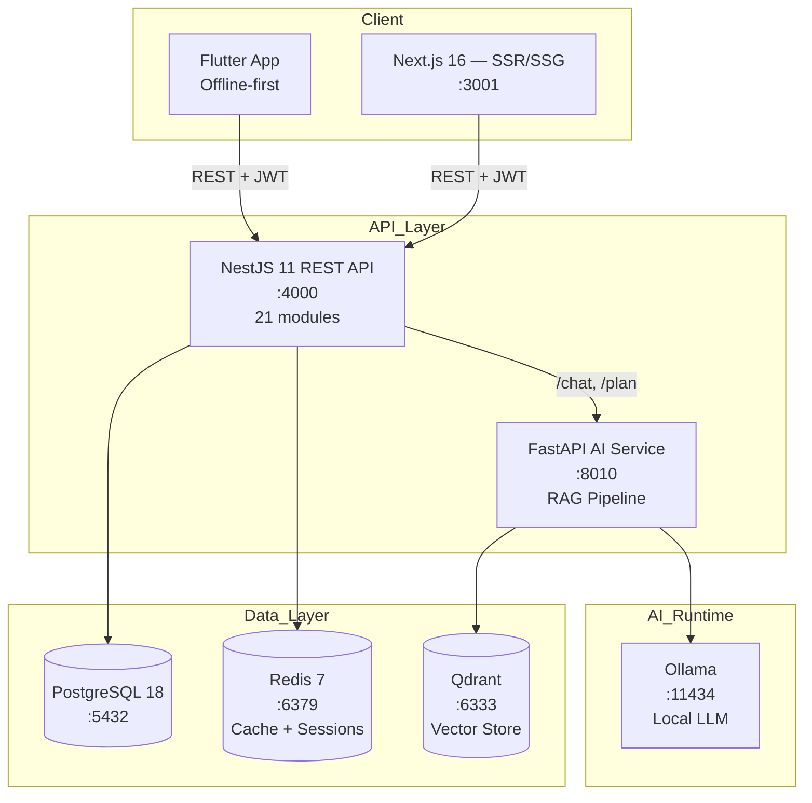

---

## Điểm Nổi Bật Kỹ Thuật

| Khía cạnh                   | Chi tiết                                                                                      |
| --------------------------- | --------------------------------------------------------------------------------------------- |
| **AI/RAG chạy local**       | Ollama LLM + Qdrant vector DB — không cần API key, không mất phí, dữ liệu riêng tư            |
| **Monorepo thực thụ**       | pnpm workspaces + Turborepo — shared types, parallel builds, dependency graph                 |
| **Security**                | JWT rotation (15 phút access / 7 ngày refresh), rate limiting, CORS, helmet, input validation |
| **Docker production-ready** | Multi-stage builds, non-root user, health checks, layer caching                               |
| **CI/CD 7 jobs**            | typecheck, lint+test, security audit, gitleaks, E2E, Docker build, mobile                     |
| **Testing đa tầng**         | Unit (Vitest) + E2E (Playwright) + Load (k6) + Property-based (fast-check)                    |
| **Mobile offline-first**    | Flutter + Riverpod, local cache, sandbox bookings, offline AI fallback                        |
| **Design System**           | Custom Tailwind tokens (tv-\*), responsive, WCAG accessible                                   |
| **4 ADRs**                  | Ghi chép quyết định: NestJS, Prisma, mock payment, monorepo structure                         |

---

## Tính Năng Chi Tiết

### Hệ Thống Đặt Chỗ

- Đặt tour với lịch trình chi tiết, gallery ảnh, đánh giá
- Đặt khách sạn với bộ lọc giá, tiện nghi, vị trí
- Tìm chuyến bay với so sánh giá
- Hệ thống thanh toán demo (sandbox, không giao dịch thật)
- Mã giảm giá và chương trình loyalty

### Tính Năng AI

- **AI Trip Planner** — Lập lịch trình tự động theo số ngày, ngân sách, sở thích
- **Chat Assistant** — Hỏi đáp về du lịch, gợi ý địa điểm, ẩm thực
- **Budget Estimator** — Ước tính chi phí theo điểm đến và thời gian
- **Personality Quiz** — Gợi ý phong cách du lịch phù hợp
- **Destination Compare** — So sánh nhiều điểm đến

### Admin Dashboard

- Biểu đồ doanh thu (AreaChart), booking status (PieChart)
- Top tours ranking (BarChart)
- Quản lý: users, tours, hotels, destinations, bookings, coupons, blogs, reviews
- AI Knowledge base management
- Hệ thống contact/support ticket

### Ứng Dụng Mobile (Flutter)

- Offline-first architecture với local cache
- Sandbox booking (không giao dịch thật)
- AI chat fallback khi mất mạng
- QR code vé điện tử demo
- Wishlist và itinerary planner

---

## Yêu Cầu Hệ Thống

| Phần mềm                | Phiên bản tối thiểu      |
| ----------------------- | ------------------------ |
| Node.js                 | >= 22.x                  |
| pnpm                    | >= 10.x                  |
| Docker & Docker Compose | Latest                   |
| PostgreSQL              | 18 (qua Docker)          |
| Python                  | >= 3.12 (cho AI service) |
| Flutter                 | >= 3.x (cho mobile)      |

---

## Cài Đặt Nhanh

### 1. Clone repository

```bash
git clone https://github.com/JasonTM17/ChillTravel_NextJS.git wanderviet
cd wanderviet
```

### 2. Cài đặt dependencies

```bash
pnpm install
```

### 3. Cấu hình môi trường

```bash
cp .env.example .env
# Chỉnh sửa .env với thông tin database và các config cần thiết
```

### 4. Khởi chạy infrastructure (Docker)

```bash
docker compose -f infra/docker/docker-compose.yml up -d
```

Dịch vụ sẽ khởi chạy: PostgreSQL, Redis, Qdrant, Ollama

### 5. Chạy database migrations & seed

```bash
pnpm --filter @vietwander/db prisma migrate dev
pnpm seed
```

### 6. Khởi chạy development servers

```bash
pnpm dev
```

| Dịch vụ    | URL                            |
| ---------- | ------------------------------ |
| Web        | http://localhost:3001          |
| API        | http://localhost:4000/api/v1   |
| Swagger    | http://localhost:4000/api/docs |
| AI Service | http://localhost:8010          |

---

## Docker

### Chạy toàn bộ hệ thống

```bash
docker compose -f infra/docker/docker-compose.yml up -d
```

### Docker Images trên Docker Hub

| Image | Link                                                                                  |
| ----- | ------------------------------------------------------------------------------------- |
| API   | [nguyenson1710/wanderviet-api](https://hub.docker.com/r/nguyenson1710/wanderviet-api) |
| Web   | [nguyenson1710/wanderviet-web](https://hub.docker.com/r/nguyenson1710/wanderviet-web) |
| AI    | [nguyenson1710/wanderviet-ai](https://hub.docker.com/r/nguyenson1710/wanderviet-ai)   |

### GitHub Packages (ghcr.io)

| Image | Link                                                                                                              |
| ----- | ----------------------------------------------------------------------------------------------------------------- |
| API   | [ghcr.io/jasontm17/wanderviet-api](https://github.com/JasonTM17/ChillTravel_NextJS/pkgs/container/wanderviet-api) |
| Web   | [ghcr.io/jasontm17/wanderviet-web](https://github.com/JasonTM17/ChillTravel_NextJS/pkgs/container/wanderviet-web) |
| AI    | [ghcr.io/jasontm17/wanderviet-ai](https://github.com/JasonTM17/ChillTravel_NextJS/pkgs/container/wanderviet-ai)   |

### Build local

```bash
docker compose -f infra/docker/docker-compose.yml build
```

---

## Tài Khoản Demo

| Vai trò | Email                  | Mật khẩu       |
| ------- | ---------------------- | -------------- |
| Admin   | `admin@wanderviet.com` | `Admin@123456` |
| User    | `user@wanderviet.com`  | `User@123456`  |

> **Lưu ý:** Hệ thống thanh toán là mock/demo — không xử lý giao dịch thật.

---

## API Documentation

API documentation được tạo tự động bằng Swagger/OpenAPI:

- **Swagger UI:** http://localhost:4000/api/docs
- **OpenAPI JSON:** http://localhost:4000/api/docs-json

### API Modules (21)

| Module        | Mô tả                                            |
| ------------- | ------------------------------------------------ |
| Auth          | Đăng ký, đăng nhập, refresh token, quên mật khẩu |
| Users         | CRUD users, profile, avatar upload               |
| Tours         | CRUD tours, tìm kiếm, lọc, phân trang            |
| Hotels        | CRUD hotels, phòng, tiện nghi                    |
| Flights       | Tìm chuyến bay, so sánh giá                      |
| Bookings      | Đặt tour/hotel/flight, trạng thái, lịch sử       |
| Payments      | Mock payment processing, hoàn tiền               |
| Reviews       | Đánh giá, rating, kiểm duyệt                     |
| Destinations  | Điểm đến, danh mục, phổ biến                     |
| Coupons       | Mã giảm giá, validation, theo dõi sử dụng        |
| Blogs         | Bài viết, danh mục, bình luận                    |
| Contacts      | Liên hệ, support tickets                         |
| Notifications | Push notifications, email                        |
| Loyalty       | Điểm thưởng, hạng thành viên, rewards            |
| Analytics     | Dashboard metrics, doanh thu, xu hướng           |
| Upload        | Upload file (ảnh, tài liệu)                      |
| Health        | Health check endpoints                           |
| AI Chat       | Proxy tới AI service                             |
| AI Planner    | Lập lịch trình endpoints                         |
| AI Budget     | Ước tính ngân sách                               |
| AI Knowledge  | Quản lý RAG knowledge base                       |

---

## Testing

```bash
# Unit tests
pnpm test

# Type checking
pnpm typecheck

# Linting
pnpm lint

# E2E tests (cần Playwright browsers)
pnpm e2e

# Load testing
pnpm load-test

# AI service tests
pnpm ai:test
```

### CI Pipeline (7 jobs)

| Job              | Mô tả                                    |
| ---------------- | ---------------------------------------- |
| `web-api-ai`     | Lint + Unit tests + Build (Node 22 & 24) |
| `typecheck`      | TypeScript strict mode check             |
| `security-audit` | pnpm audit (high/critical)               |
| `gitleaks`       | Quét secrets                             |
| `mobile`         | Flutter analyze + test                   |
| `e2e`            | Playwright end-to-end tests              |
| `docker-build`   | Build Docker images (khi push lên main)  |

---

## Tài Liệu

| Tài liệu                                            | Mô tả                                  |
| --------------------------------------------------- | -------------------------------------- |
| [Kiến trúc](./docs/architecture.vi.md)              | Tổng quan kiến trúc hệ thống           |
| [Tính năng](./docs/FEATURES.vi.md)                  | Chi tiết 41 trang và tính năng         |
| [ADRs](./docs/adr/)                                 | Architecture Decision Records (4 ADRs) |
| [Sơ đồ ER](./docs/er-diagram.vi.md)                 | Sơ đồ quan hệ thực thể                 |
| [Đóng góp](./CONTRIBUTING.vi.md)                    | Hướng dẫn đóng góp                     |
| [Nhật ký](./CHANGELOG.vi.md)                        | Lịch sử thay đổi                       |
| [Release Checklist](./docs/release-checklist.vi.md) | Quy trình release                      |

---

## Cấu Trúc Trang

| Nhóm        | Trang                                                                                                     |
| ----------- | --------------------------------------------------------------------------------------------------------- |
| **Booking** | Tour listing, Tour detail, Hotel detail, Flight search, Booking form, Payment, Success                    |
| **AI**      | AI Planner, Chat, Budget estimator, Personality quiz, Destination compare                                 |
| **User**    | Login, Register, Profile, Wishlist, My Bookings, Notifications, Loyalty                                   |
| **Admin**   | Dashboard, Users, Tours, Hotels, Destinations, Bookings, Coupons, Blogs, Reviews, Analytics, AI Knowledge |
| **Explore** | Search, Map, Experiences, Trips, Destinations                                                             |

---

## Scripts

```bash
pnpm dev              # Chạy tất cả dev servers (Turborepo)
pnpm build            # Build production
pnpm lint             # ESLint + Prettier check
pnpm typecheck        # TypeScript strict check
pnpm test             # Vitest unit tests
pnpm e2e              # Playwright E2E tests
pnpm docker:up        # Docker Compose up
pnpm docker:down      # Docker Compose down
pnpm docker:logs      # Xem logs
pnpm seed             # Seed database
pnpm ai:test          # Python AI service tests
pnpm load-test        # k6 load testing
pnpm storybook        # Component storybook
pnpm format           # Prettier format all
```

---

## Packages

| Package              | Mô tả                           | Đường dẫn         |
| -------------------- | ------------------------------- | ----------------- |
| `@vietwander/web`    | Next.js 16 frontend (41 trang)  | `apps/web`        |
| `@vietwander/api`    | NestJS 11 REST API (21 modules) | `apps/api`        |
| `@vietwander/e2e`    | Playwright E2E tests            | `e2e`             |
| `@vietwander/shared` | Shared types & API contracts    | `packages/shared` |
| `@vietwander/db`     | Prisma schema, migrations, seed | `packages/db`     |
| `@vietwander/config` | Shared ESLint, TS configs       | `packages/config` |
| `ai-service`         | FastAPI + Ollama + Qdrant       | `apps/ai-service` |
| `mobile`             | Flutter app (wanderviet)        | `apps/mobile`     |

---

## License

Dự án được phân phối dưới giấy phép [MIT](./LICENSE).

Copyright (c) 2026 [Nguyen Son](https://github.com/JasonTM17)
