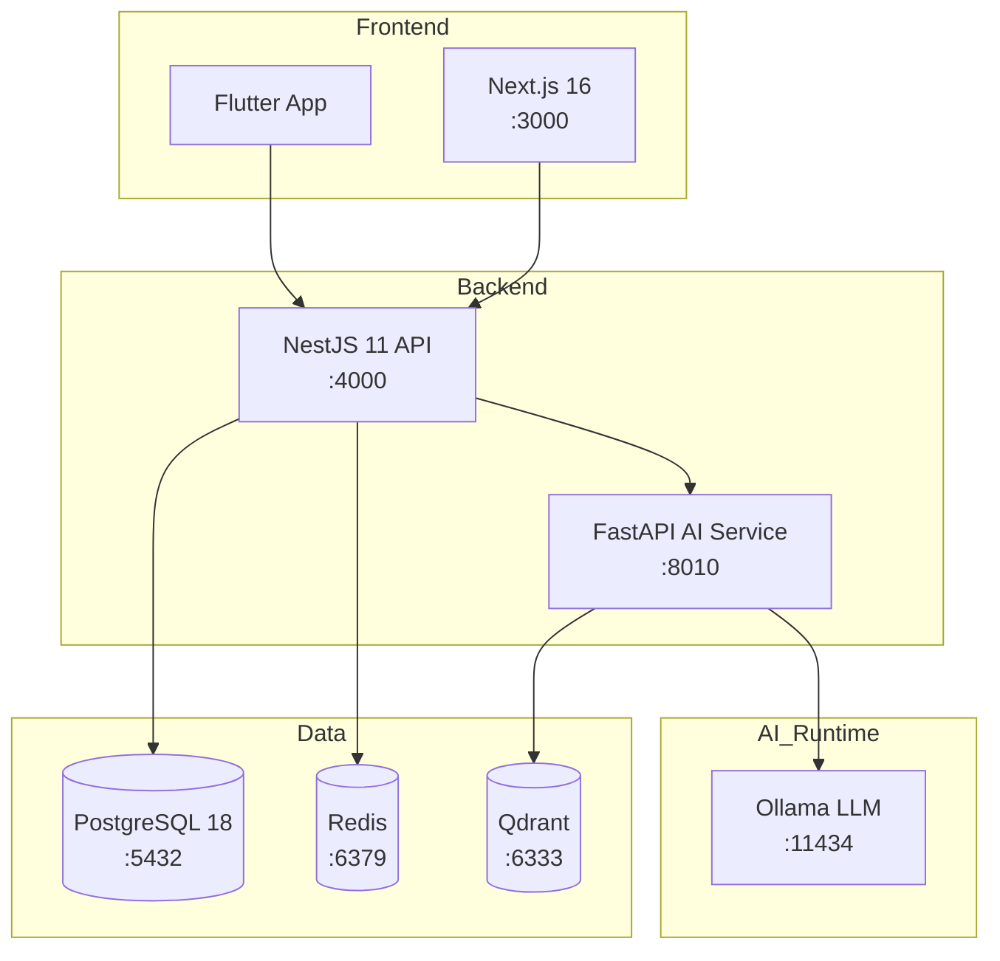

# Architecture Overview

> For the full technical design, see [`.kiro/specs/wanderviet-travel-platform/design.md`](../.kiro/specs/wanderviet-travel-platform/design.md).
> For Architecture Decision Records, see [`docs/adr/`](./adr/).
> For the Entity-Relationship diagram, see [`docs/er-diagram.md`](./er-diagram.md).

## System Context

```
┌─────────────────┐     ┌──────────────────┐     ┌──────────────────┐
│  Next.js 16     │────▶│  NestJS 11 API   │────▶│  PostgreSQL 18   │
│  apps/web       │     │  apps/api        │     │  (Prisma 7 ORM)  │
│  :3000          │     │  :4000 /api/v1   │     │  :5432           │
└─────────────────┘     └──────────────────┘     └──────────────────┘
                                │
                                ▼
                        ┌──────────────────┐
                        │  FastAPI AI      │
                        │  apps/ai-service │
                        │  :8010           │
                        └──────────────────┘
```

## Monorepo Layout

```
wanderviet/
├── apps/
│   ├── api/          # NestJS 11 — REST API, Swagger at /api/docs
│   ├── web/          # Next.js 16 — Vietnamese-first frontend
│   ├── ai-service/   # FastAPI — local RAG (Ollama + Qdrant, no cloud key)
│   └── mobile/       # Flutter — mobile app structure
├── packages/
│   ├── shared/       # Shared TypeScript types and API contracts
│   ├── db/           # Prisma schema, migrations, seed data
│   └── config/       # Shared ESLint, TypeScript, build configs
├── infra/docker/     # Docker Compose (postgres, redis, qdrant, api, web, ai)
├── e2e/              # Playwright end-to-end tests
├── load-tests/       # k6 load test scripts
└── docs/             # ADRs, ER diagram, architecture notes
```

## Key Decisions

| Concern           | Choice                          | ADR                                             |
| ----------------- | ------------------------------- | ----------------------------------------------- |
| Backend framework | NestJS 11 (TypeScript)          | [ADR-001](./adr/001-nestjs-over-spring-boot.md) |
| ORM               | Prisma 7                        | [ADR-002](./adr/002-prisma-over-typeorm.md)     |
| Payment           | Mock-only                       | [ADR-003](./adr/003-mock-payment-only.md)       |
| Monorepo tooling  | pnpm + Turborepo                | [ADR-004](./adr/004-pnpm-turborepo-monorepo.md) |
| Auth              | JWT access (15m) + refresh (7d) | design.md §4                                    |
| AI runtime        | Ollama + Qdrant, no OpenAI key  | design.md §17                                   |

## Deployment Architecture

All services are containerized and orchestrated via Docker Compose (`infra/docker/docker-compose.yml`).

| Service        | Image                              | Port Mapping       | Notes                          |
| -------------- | ---------------------------------- | ------------------ | ------------------------------ |
| api            | `nguyenson1710/wanderviet-api`     | `4000:4000`        | NestJS REST API                |
| web            | `nguyenson1710/wanderviet-web`     | `3000:3000`        | Next.js frontend               |
| ai-service     | Built from `apps/ai-service/`      | `8010:8010`        | FastAPI RAG service            |
| postgres       | `postgres:18-alpine`               | `5432:5432`        | Primary database               |
| redis          | `redis:7-alpine`                   | `6379:6379`        | Caching & session store        |
| qdrant         | `qdrant/qdrant:latest`             | `6333:6333`        | Vector database for RAG        |
| ollama         | `ollama/ollama:latest`             | `11434:11434`      | Local LLM inference            |

### Docker Build Strategy

- **api**: Multi-stage build — `pnpm install` → `tsc` compile → slim runtime image
- **web**: Multi-stage build — `pnpm install` → `next build` → standalone output
- **ai-service**: Python slim image with `requirements.txt` dependencies

## AI/RAG Pipeline

The AI service uses a Retrieval-Augmented Generation (RAG) architecture to provide travel recommendations without requiring external API keys.

### Pipeline Flow

1. **Knowledge Base Ingestion** — Markdown files in `apps/ai-service/knowledge/` are chunked and embedded into Qdrant on startup
2. **Model Loading** — Ollama pulls and serves the configured LLM model (e.g., `llama3.2`) locally
3. **Query Processing** — User queries are embedded, similar chunks retrieved from Qdrant, and context is passed to Ollama for generation
4. **Tool Augmentation** — The AI service exposes travel-specific tools (search destinations, check availability) that the LLM can invoke

### Data Flow

```
User Query → FastAPI → Embed Query → Qdrant (similarity search)
                                          ↓
                              Retrieved Context + Query → Ollama → Response
```

### Knowledge Base Structure

```
apps/ai-service/knowledge/
├── vietnam/          # Vietnamese destination guides
│   ├── da-nang.md
│   └── phu-quoc.md
└── world/            # International destination guides
    └── paris.md
```

## Component Diagram


