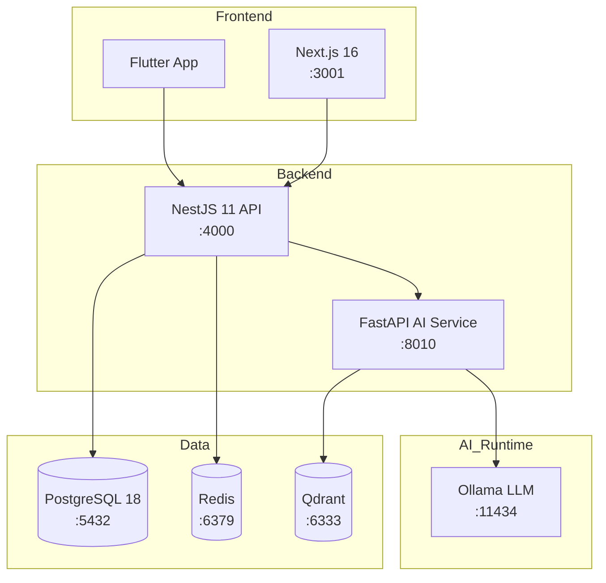

# Tổng Quan Kiến Trúc

> Xem thiết kế kỹ thuật đầy đủ tại [`.kiro/specs/wanderviet-travel-platform/design.md`](../.kiro/specs/wanderviet-travel-platform/design.md).
> Xem Architecture Decision Records tại [`docs/adr/`](./adr/).
> Xem sơ đồ Entity-Relationship tại [`docs/er-diagram.md`](./er-diagram.md).

## Bối Cảnh Hệ Thống

```
┌─────────────────┐     ┌──────────────────┐     ┌──────────────────┐
│  Next.js 16     │────▶│  NestJS 11 API   │────▶│  PostgreSQL 18   │
│  apps/web       │     │  apps/api        │     │  (Prisma 7 ORM)  │
│  :3001          │     │  :4000 /api/v1   │     │  :5432           │
└─────────────────┘     └──────────────────┘     └──────────────────┘
                                │
                                ▼
                        ┌──────────────────┐
                        │  FastAPI AI      │
                        │  apps/ai-service │
                        │  :8010           │
                        └──────────────────┘
```

## Cấu Trúc Monorepo

```
wanderviet/
├── apps/
│   ├── api/          # NestJS 11 — REST API, Swagger tại /api/docs
│   ├── web/          # Next.js 16 — Frontend ưu tiên tiếng Việt
│   ├── ai-service/   # FastAPI — RAG cục bộ (Ollama + Qdrant, không cần cloud key)
│   └── mobile/       # Flutter — Ứng dụng di động
├── packages/
│   ├── shared/       # Shared TypeScript types và API contracts
│   ├── db/           # Prisma schema, migrations, seed data
│   └── config/       # Shared ESLint, TypeScript, build configs
├── infra/docker/     # Docker Compose (postgres, redis, qdrant, api, web, ai)
├── e2e/              # Playwright end-to-end tests
├── load-tests/       # k6 load test scripts
└── docs/             # ADRs, ER diagram, ghi chú kiến trúc
```

## Quyết Định Chính

| Vấn đề            | Lựa chọn                        | ADR                                             |
| ----------------- | ------------------------------- | ----------------------------------------------- |
| Backend framework | NestJS 11 (TypeScript)          | [ADR-001](./adr/001-nestjs-over-spring-boot.md) |
| ORM               | Prisma 7                        | [ADR-002](./adr/002-prisma-over-typeorm.md)     |
| Thanh toán        | Chỉ mock                        | [ADR-003](./adr/003-mock-payment-only.md)       |
| Monorepo tooling  | pnpm + Turborepo                | [ADR-004](./adr/004-pnpm-turborepo-monorepo.md) |
| Xác thực          | JWT access (15p) + refresh (7n) | design.md §4                                    |
| AI runtime        | Ollama + Qdrant, không OpenAI   | design.md §17                                   |

## Kiến Trúc Triển Khai

Tất cả services được container hóa và điều phối qua Docker Compose (`infra/docker/docker-compose.yml`).

| Service    | Image                          | Port Mapping  | Ghi chú                 |
| ---------- | ------------------------------ | ------------- | ----------------------- |
| api        | `nguyenson1710/wanderviet-api` | `4000:4000`   | NestJS REST API         |
| web        | `nguyenson1710/wanderviet-web` | `3001:3001`   | Next.js frontend        |
| ai-service | Build từ `apps/ai-service/`    | `8010:8010`   | FastAPI RAG service     |
| postgres   | `postgres:18-alpine`           | `5432:5432`   | Database chính          |
| redis      | `redis:7-alpine`               | `6379:6379`   | Caching & session store |
| qdrant     | `qdrant/qdrant:latest`         | `6333:6333`   | Vector database cho RAG |
| ollama     | `ollama/ollama:latest`         | `11434:11434` | LLM inference cục bộ    |

### Chiến Lược Build Docker

- **api**: Multi-stage build — `pnpm install` → `tsc` compile → slim runtime image
- **web**: Multi-stage build — `pnpm install` → `next build` → standalone output
- **ai-service**: Python slim image với `requirements.txt` dependencies

## Pipeline AI/RAG

Dịch vụ AI sử dụng kiến trúc Retrieval-Augmented Generation (RAG) để cung cấp gợi ý du lịch mà không cần API key bên ngoài.

### Luồng Pipeline

1. **Nạp Cơ Sở Kiến Thức** — File Markdown trong `apps/ai-service/knowledge/` được chia chunk và nhúng vào Qdrant khi khởi động
2. **Tải Model** — Ollama pull và phục vụ model LLM đã cấu hình (vd: `llama3.2`) cục bộ
3. **Xử Lý Truy Vấn** — Truy vấn người dùng được nhúng, chunks tương tự được truy xuất từ Qdrant, và context được truyền cho Ollama để sinh câu trả lời
4. **Tăng Cường Công Cụ** — Dịch vụ AI cung cấp các công cụ chuyên biệt du lịch (tìm điểm đến, kiểm tra khả dụng) mà LLM có thể gọi

### Luồng Dữ Liệu

```
Truy vấn người dùng → FastAPI → Nhúng truy vấn → Qdrant (tìm kiếm tương tự)
                                                       ↓
                                         Context truy xuất + Truy vấn → Ollama → Phản hồi
```

### Cấu Trúc Cơ Sở Kiến Thức

```
apps/ai-service/knowledge/
├── vietnam/          # Hướng dẫn điểm đến Việt Nam
│   ├── da-nang.md
│   └── phu-quoc.md
└── world/            # Hướng dẫn điểm đến quốc tế
    └── paris.md
```

## Sơ Đồ Component


