# WanderViet — Sơ Đồ Entity-Relationship

Sinh từ `packages/db/prisma/schema.prisma`. Phản ánh schema WanderViet đã phát triển (các model legacy WanderViet được bỏ qua cho rõ ràng; xem schema.prisma cho toàn bộ bao gồm Trip, ChatbotSession, AiKnowledge\*, v.v.).

```mermaid
erDiagram

    %% =========================================================
    %% ĐỊNH DANH & TRUY CẬP
    %% =========================================================

    User {
        string  id          PK
        string  email       UK
        string  password
        string  role        "USER | ADMIN | STAFF"
        string  fullName
        string  phone
        string  avatarUrl
        string  status      "ACTIVE | INACTIVE | BANNED"
        boolean emailVerified
        datetime createdAt
        datetime updatedAt
    }

    RefreshToken {
        string   id          PK
        string   userId      FK
        string   tokenHash   UK
        datetime expiresAt
        boolean  revoked
        datetime createdAt
    }

    AccountLockout {
        string   userId      PK "FK → User"
        datetime lockedUntil
        string   reason
    }

    LoginAttempt {
        string   id          PK
        string   email
        string   ipAddress
        boolean  success
        datetime createdAt
    }

    %% =========================================================
    %% ĐỊA LÝ / ĐIỂM ĐẾN
    %% =========================================================

    Destination {
        string  id              PK
        string  slug            UK
        string  name
        string  countryId       FK
        string  cityId          FK
        string  description
        string  shortDescription
        string  imageUrl
        string  category
        string  status          "ACTIVE | INACTIVE | DELETED"
        float   ratingAvg
        int     reviewCount
        boolean isFeatured
        datetime createdAt
        datetime updatedAt
    }

    DestinationImage {
        string id            PK
        string destinationId FK
        string url
        string altText
        int    sortOrder
    }

    %% =========================================================
    %% TOUR
    %% =========================================================

    Tour {
        string   id              PK
        string   slug            UK
        string   title
        string   destinationId   FK
        string   description
        int      durationDays
        int      durationNights
        int      basePrice       "VND"
        int      salePrice
        int      maxGuests
        int      minGuests
        int      availableSlots
        string   status          "ACTIVE | INACTIVE | DELETED"
        boolean  featured
        string   imageUrl
        string   category
        datetime createdAt
        datetime updatedAt
    }

    TourImage {
        string id        PK
        string tourId    FK
        string url
        string altText
        int    sortOrder
    }

    TourItinerary {
        string id          PK
        string tourId      FK
        int    dayNumber
        string title
        string description
        string meals
        string accommodation
        string activities
    }

    TourDeparture {
        string   id             PK
        string   tourId         FK
        datetime departureDate
        datetime returnDate
        int      availableSlots
        int      priceOverride
        string   status         "OPEN | CLOSED | SOLDOUT"
    }

    %% =========================================================
    %% ĐẶT CHỖ / THANH TOÁN / MÃ GIẢM GIÁ
    %% =========================================================

    Booking {
        string   id             PK
        string   bookingCode    UK
        string   userId         FK
        string   tourId         FK
        string   departureId    FK
        string   couponId       FK
        string   status         "pending | confirmed | cancelled | completed | refunded_mock"
        string   paymentStatus  "pending | confirmed_mock | failed_mock | refunded_mock"
        int      totalAmount    "VND"
        int      discountAmount
        string   currency
        string   contactName
        string   contactEmail
        string   contactPhone
        int      numberOfGuests
        string   specialRequest
        boolean  isDemo
        datetime bookingDate
        datetime createdAt
        datetime updatedAt
    }

    BookingItem {
        string id        PK
        string bookingId FK
        string itemType
        string itemName
        int    amount
    }

    BookingGuest {
        string   id          PK
        string   bookingId   FK
        string   fullName
        datetime dateOfBirth
        string   gender
        string   note
    }

    Payment {
        string   id              PK
        string   bookingId       UK "FK → Booking"
        string   provider        "MOCK"
        int      amount
        string   currency
        string   status          "pending | confirmed_mock | failed_mock | refunded_mock"
        string   transactionCode UK
        datetime paidAt
        datetime createdAt
        datetime updatedAt
    }

    Coupon {
        string   id               PK
        string   code             UK
        string   description
        string   discountType     "PERCENT | FIXED"
        int      discountValue
        int      minBookingAmount
        int      maxDiscountAmount
        int      usageLimit
        int      usedCount
        datetime validFrom
        datetime validTo
        boolean  isActive
        datetime createdAt
    }

    %% =========================================================
    %% ĐÁNH GIÁ & YÊU THÍCH
    %% =========================================================

    Review {
        string   id            PK
        string   userId        FK
        string   tourId        FK
        string   destinationId FK
        int      rating        "1–5"
        string   title
        string   content
        string   status        "PENDING | APPROVED | REJECTED | HIDDEN"
        datetime createdAt
        datetime updatedAt
    }

    WishlistEntry {
        string   id        PK
        string   userId    FK
        string   itemId
        string   itemType  "TOUR | DESTINATION"
        datetime createdAt
    }

    %% =========================================================
    %% CMS — BLOG + LIÊN HỆ
    %% =========================================================

    BlogPost {
        string   id            PK
        string   slug          UK
        string   title
        string   excerpt
        string   content
        string   coverImageUrl
        string   category
        string   status        "DRAFT | PUBLISHED | DELETED"
        string   authorId      FK
        datetime publishedAt
        datetime createdAt
        datetime updatedAt
    }

    ContactRequest {
        string   id                    PK
        string   name
        string   email
        string   phone
        string   destinationInterested
        string   message
        string   status               "NEW | IN_PROGRESS | RESOLVED | CLOSED"
        string   assignedTo           FK
        string   adminNote
        datetime createdAt
        datetime updatedAt
    }

    %% =========================================================
    %% AUDIT / THÔNG BÁO
    %% =========================================================

    Notification {
        string   id        PK
        string   userId    FK
        string   type      "BOOKING_CONFIRMED | BOOKING_CANCELLED | BOOKING_COMPLETED | REVIEW_APPROVED | CONTACT_REPLY | SYSTEM"
        string   title
        string   body
        string   link
        boolean  read
        datetime createdAt
    }

    AuditLog {
        string   id           PK
        string   actorId      FK
        string   action
        string   entity
        string   resourceType
        string   resourceId
        json     metadata
        datetime createdAt
    }

    %% =========================================================
    %% QUAN HỆ
    %% =========================================================

    %% Định danh
    User ||--o{ RefreshToken      : "có"
    User ||--o| AccountLockout    : "có thể có"

    %% Điểm đến
    Destination ||--o{ DestinationImage : "có"
    Destination ||--o{ Tour             : "có"

    %% Tour
    Tour ||--o{ TourImage      : "có"
    Tour ||--o{ TourItinerary  : "có"
    Tour ||--o{ TourDeparture  : "có"

    %% Đặt chỗ
    User         ||--o{ Booking      : "tạo"
    Tour         ||--o{ Booking      : "được đặt qua"
    TourDeparture ||--o{ Booking     : "lên lịch vào"
    Coupon       ||--o{ Booking      : "áp dụng cho"
    Booking      ||--o{ BookingItem  : "chứa"
    Booking      ||--o{ BookingGuest : "bao gồm"
    Booking      ||--o| Payment      : "thanh toán qua"

    %% Đánh giá
    User        ||--o{ Review : "viết"
    Tour        ||--o{ Review : "nhận"
    Destination ||--o{ Review : "nhận"

    %% Yêu thích
    User ||--o{ WishlistEntry : "lưu"

    %% Blog
    User ||--o{ BlogPost : "tác giả"

    %% Liên hệ
    User ||--o{ ContactRequest : "được giao"

    %% Thông báo & Audit
    User ||--o{ Notification : "nhận"
    User ||--o{ AuditLog     : "thực hiện"
```

---

## Ghi Chú Quan Hệ Chính

| Quan hệ                          | Cardinality | Ghi chú                                                               |
| -------------------------------- | ----------- | --------------------------------------------------------------------- |
| User → Booking                   | 1:N         | Một user có thể có nhiều bookings                                     |
| Tour → Booking                   | 1:N         | Một tour có thể có nhiều bookings qua các đợt khởi hành               |
| TourDeparture → Booking          | 1:N         | Mỗi booking gắn với một ngày khởi hành cụ thể                         |
| Booking → Payment                | 1:1         | Một bản ghi thanh toán chính thức cho mỗi booking                     |
| Booking → BookingGuest           | 1:N         | Một dòng cho mỗi du khách trong nhóm                                  |
| Coupon → Booking                 | 1:N         | Một coupon có thể áp dụng cho nhiều bookings (tối đa `usageLimit`)    |
| Tour → Review                    | 1:N         | Đánh giá thuộc về tour; chỉ users có booking `completed` mới được gửi |
| Destination → Review             | 1:N         | Đánh giá cấp điểm đến legacy (tương thích WanderViet)                 |
| User → WishlistEntry             | 1:N         | Danh sách yêu thích phẳng; `itemType` phân biệt TOUR vs DESTINATION   |
| User → BlogPost                  | 1:N         | Admin/Staff users tạo blog posts                                      |
| User → ContactRequest (assignee) | 1:N         | Staff member được giao xử lý liên hệ                                  |

## Tham Chiếu Nhanh Enum

| Trường                  | Giá trị                                                                                                     |
| ----------------------- | ----------------------------------------------------------------------------------------------------------- |
| `User.role`             | `USER`, `ADMIN`, `STAFF` (+ legacy `HOST`, `GUIDE`)                                                         |
| `User.status`           | `ACTIVE`, `INACTIVE`, `BANNED`                                                                              |
| `Destination.status`    | `ACTIVE`, `INACTIVE`, `DELETED`                                                                             |
| `Tour.status`           | `ACTIVE`, `INACTIVE`, `DELETED`                                                                             |
| `TourDeparture.status`  | `OPEN`, `CLOSED`, `SOLDOUT` (string)                                                                        |
| `Booking.status`        | `pending`, `confirmed`, `cancelled`, `completed`, `refunded_mock`                                           |
| `Booking.paymentStatus` | `pending`, `confirmed_mock`, `failed_mock`, `refunded_mock`                                                 |
| `Review.status`         | `PENDING`, `APPROVED`, `REJECTED`, `HIDDEN`                                                                 |
| `BlogPost.status`       | `DRAFT`, `PUBLISHED`, `DELETED`                                                                             |
| `ContactRequest.status` | `NEW`, `IN_PROGRESS`, `RESOLVED`, `CLOSED`                                                                  |
| `Coupon.discountType`   | `PERCENT`, `FIXED`                                                                                          |
| `Notification.type`     | `BOOKING_CONFIRMED`, `BOOKING_CANCELLED`, `BOOKING_COMPLETED`, `REVIEW_APPROVED`, `CONTACT_REPLY`, `SYSTEM` |
